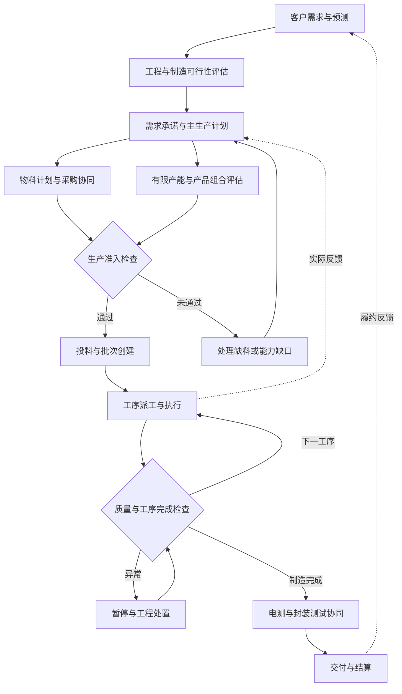
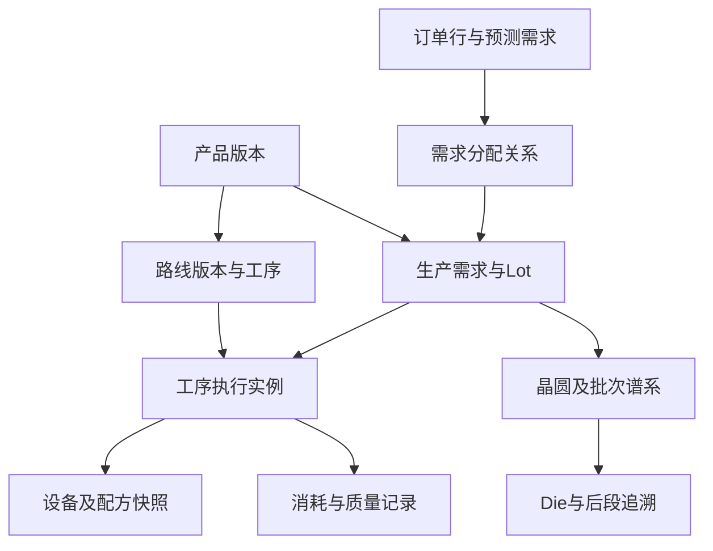
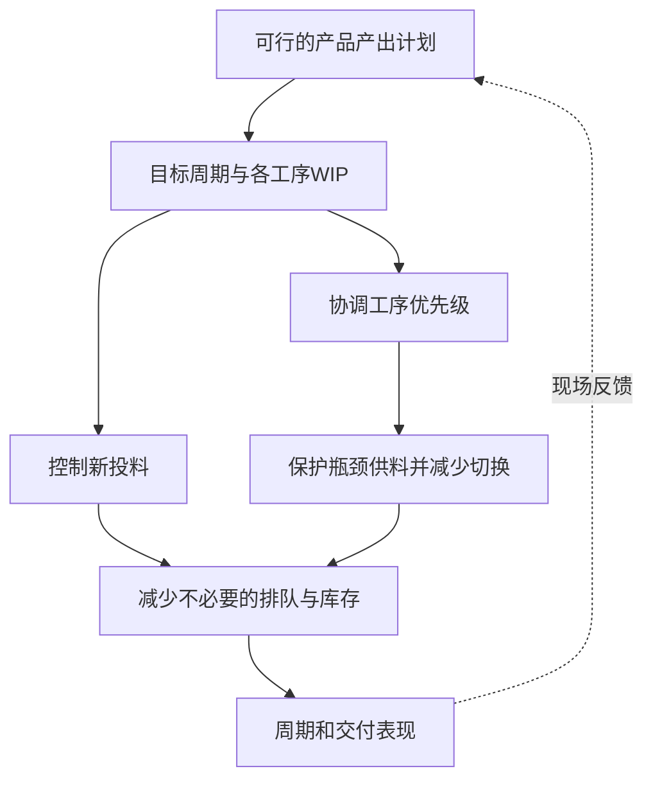
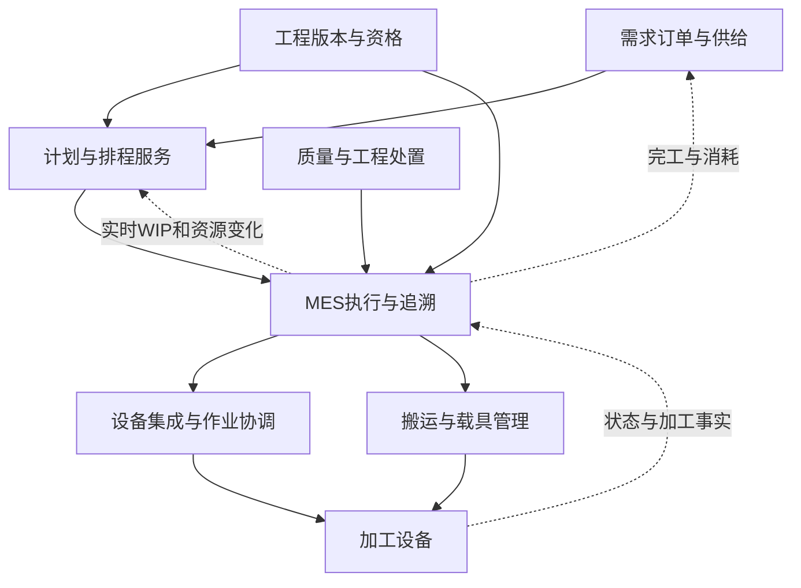
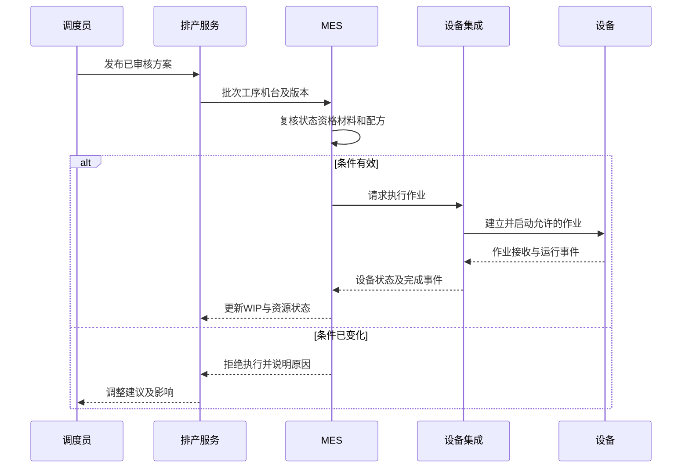
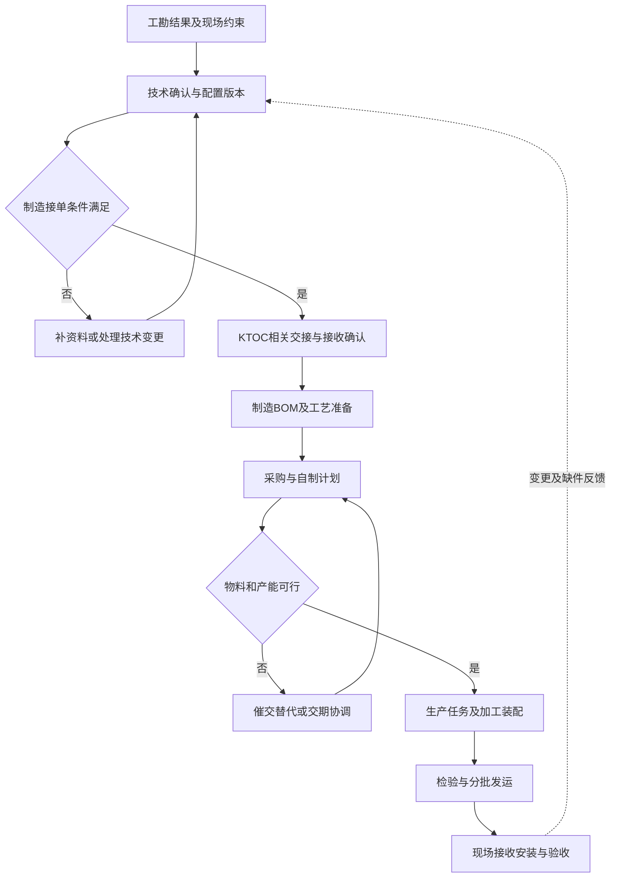

# 半导体制造与排产产品专家知识库 2.0

> 从客户需求到生产交付：MES、计划、物料、排程、SLIM，以及电梯工勘到制造的迁移学习。
>
> 编写日期：2026-09-09。用途：面试准备、现场调研、产品方案与产品负责人能力建设。

## 2.0新增：从知识地图走到业务实务

2.0保留下面的16章总览，并持续增加可交叉阅读的实务专题。最近更新：2026-09-10。

| 实务文档 | 内容 | 对应本次补齐的缺口 |
|---|---|---|
| [一张订单、三个批次、两台设备](docs/01-end-to-end-case.md) | 24,000颗需求的投片计算、物料净需求、班次活动、缺料、故障、插单和交付补缺 | 真实工作日的调研脚本；完整数字演算 |
| [排程方法、波动与验证](docs/02-scheduling-and-variability.md) | FIFO/交期/松弛/组批/SLIM/优化/仿真的选择，排队演算和回放方法 | 方法选择；波动与产能余量 |
| [MES事务、工程变更与新品导入](docs/03-mes-and-npi.md) | 状态维度、进出站、Hold、拆合批、返工、事件幂等、NPI与版本切换 | MES事务规格；新品与工程变更 |
| [产品负责人、交付运营与通力调研包](docs/04-product-delivery-and-kone.md) | 客户选择、商业演算、交付责任、运行恢复，以及四份KTOC调研模板 | 商业取舍；系统运营；通力实务证据 |
| [SLIM的数据自动化、算法、用户与业务价值](docs/05-slim-data-automation-value.md) | PDF覆盖度、数据与状态、五个指标、七个模块、自动化边界、角色收益及面试表达 | 将SLIM方法串成可讲、可设计、可验收的产品闭环 |
| [半导体生产状态、SLIM流动计划与完整泳道](docs/06-slim-production-state-swimlane.md) | 九阶段生产流程、Lot状态机、SLIM滚动闭环、跨角色泳道、WIP位置示例和十项实现手段 | 区分工艺流、状态流和决策流；说明短周期与低库存如何形成 |

建议阅读顺序：先看完整案例，再分别查排程方法和MES规则，最后用通力模板回看熟悉的业务。已有制造基础者可直接从试点和交付章节开始。

### 版本记录与完成边界

- **1.0**：建立16章全流程知识地图、SLIM核查、角色分工、通力调研框架及来源。
- **2.0**：新增四份实务文档，覆盖上一轮识别的8类深度缺口；补充可手算案例、状态与事务表、验收反例、工程变更、运营和商业化。
- **2.1**：新增SLIM数据自动化专题，将目标WIP、IPQ、SS、BI、MNM与M/L/S/D/I/F/O模块、用户协作、业务价值和自动化边界建立结构化映射。
- **2.2**：新增生产状态与SLIM泳道专题，补齐正常生产九阶段、Lot状态机、计划—调度—MES—现场—工程协作和滚动重算闭环。
- **仍需现场证据**：模拟工作日不等于真实跟班；构造数据不等于客户基线；KTOC模板不等于已核实流程；方法比较不等于已运行优化器或证明整厂最优。取得授权资料后逐项替换假设。

## 阅读边界与导航

本文把此前讨论的实体、角色、流程、SLIM方法串成完整业务链，并补充此前尚未充分讨论的视角。它是知识与调研框架，不是目标公司的内部操作手册，也不是通力KTOC内部系统说明书。

证据分为四类：

- **论文事实**：来自提供的SLIM论文，按原刊页码定位。2002年发表，项目始于1996年、延续至2001年；不能把案例中的设备条件、班次和改善数值当成今天所有工厂的基准。
- **公开资料**：来自ISA、SEMI、SAP和KONE等官方材料，链接列在相关章节与文末。标准介绍不等于已经审核具体标准全文。
- **方案建议**：本文提出的现代产品架构、字段、权限、验收、实施方法，需要按实际工厂配置。
- **待核实**：目标公司产品边界、KTOC含义与职责、通力内部对象和接口规则。没有证据的部分保留为问题。

所有数字演练、对象编号和接口字段均为教学示例。本文不包含客户数据、内部系统截图或未公开接口。原论文与全文译本不在此重新发布，阅读原文可使用已持有的文件或出版社链接。

| 章节 | 主要解决的问题 |
|---|---|
| [1. 能力目标与视角盲区](#s1) | 从ToB产品经理走向制造产品专家，还缺什么？ |
| [2. 行业与业务范围](#s2) | 晶圆厂、封测厂、电梯厂有什么不同？ |
| [3. 从需求到交付的全流程](#s3) | 各阶段谁决策，什么条件满足才能进入下一阶段？ |
| [4. 实体与数据关系](#s4) | 产品、工序、Lot、物料、设备、订单怎样关联？ |
| [5. 生产计划与有限产能](#s5) | 如何从订单变成可执行的生产目标？ |
| [6. 物料与齐套](#s6) | 有订单、有机器，为什么仍不能开工？ |
| [7. SLIM业务方法与边界](#s7) | 短周期与低库存到底如何实现？ |
| [8. MES及自动执行架构](#s8) | 人和系统、机器如何协同？ |
| [9. 角色、权限与交接](#s9) | 谁负责什么，谁有权改变什么？ |
| [10. 异常和变更闭环](#s10) | 故障、缺料、插单、质量问题如何处理？ |
| [11. 完整场景演练](#s11) | 如何把业务属性变成排程决策？ |
| [12. 指标与收益](#s12) | 如何证明改善有效，而非只让看板变好看？ |
| [13. 通力工勘到KTOC的调研地图](#s13) | 以前没进入的制造环节，需要补查哪些细节？ |
| [14. 产品负责人完整解决方案](#s14) | 怎样产品化、交付、验收和持续经营？ |
| [15. 90天能力建设与现场清单](#s15) | 如何形成真实业务能力与可展示成果？ |
| [16. 术语、来源与待验证问题](#s16) | 哪些是标准、案例或假设，后续怎么维护？ |

<a id="s1"></a>
## 1. 能力目标与视角盲区

### 1.1 四种目标岗位，考察重点不同

| 目标 | 核心能力 | 应能交付的证据 |
|---|---|---|
| MES产品专家 | 把物理动作变成可追溯、可控制的业务事务 | 实体模型、状态机、进出站规则、质量追溯、接口异常方案 |
| 排产专家 | 把目标、资源、限制与不确定性变成可行决策 | 约束清单、基线算法、历史回放、不可行原因、现场效果评估 |
| 生产业务专家 | 理解订单、物料、产能、现场和交付之间的冲突 | 端到端流程、岗位交接、真实异常案例与处理记录 |
| 产品负责人 | 选择市场与问题，组织研发交付并形成可持续收入 | 客户分层、产品边界、路线图、实施成本、验收和续费依据 |

这四种能力相互支持，但不能只用“会讲SLIM”代替其中任何一种。算法能力也不等于掌握全部工艺；产品负责人需要知道什么时候请工艺、设备、运筹专家共同决策。

### 1.2 当前最值得补齐的视角

以下是基于已有材料覆盖范围识别的知识缺口，不是对个人能力的判定。

| 已有关注点 | 容易遗漏的视角 | 补问的问题 |
|---|---|---|
| 项目、订单、流程状态 | 物料实体、实物位置与数量守恒 | 状态变了，实物真的移动了吗？数量是否对得上？ |
| 系统间数据传输 | 业务接单与生产准入 | 对方收到数据，是否接受订单？能否直接开工？ |
| 正常审批链 | 退回、返工、冻结、撤销、并发变更 | 数据被改后，在制品和已采购物料怎么办？ |
| 当前批次优先级 | 需求承诺、产品组合与中长期产能 | 一个订单提前，会牺牲哪些客户的交期？ |
| 机器是否空闲 | 工艺资格、腔体、掩模、人员、维护窗口 | 这台空闲机器真的能做这批吗？ |
| 库存总量 | 库存所在位置、质量状态和可用时间 | 账上有货，为什么生产仍然缺料？ |
| 平均周期 | 长尾、波动与产品结构变化 | 平均改善是否只是简单产品占比提高？ |
| 算法推荐 | 人工覆盖、稳定性和降级运行 | 推荐无法执行时，如何解释、恢复和追责？ |
| 设备利用率 | 交付、良率、成本与现金 | 忙碌是否增加有效产出，还是增加库存？ |
| 软件功能 | 买单者、使用者与现场接受度 | 谁付钱，谁使用，谁承担出错损失？ |
| 单工厂优化 | 供应商、外协、封测与客户现场 | 工厂提早做完，后段或现场是否有能力接收？ |
| 大客户定制 | 产品复用、版本升级和实施毛利 | 每家客户都改代码，是否还能规模化交付？ |

通力经历可迁移的是跨系统对象、审批、主数据与协作能力。需要补齐的是：订单进入制造后，物料和资源如何共同约束时间、数量与交期；不要把过去未负责的制造排程写成已有实践。

<a id="s2"></a>
## 2. 行业与业务范围

### 2.1 先确定服务哪一类客户

| 类型 | 业务对象与主要关切 | 对产品设计的影响 |
|---|---|---|
| Fabless设计公司 | 芯片设计、IP、流片委托、代工产能和交期 | 重点可能是供应协同与委外跟踪，不一定操作晶圆厂机台 |
| Foundry晶圆代工厂 | 多客户、多工艺平台、Lot、资格与承诺 | 客户隔离、工艺版本、有限产能、生产追溯很重要 |
| IDM | 设计、制造及部分后段协同 | 产品换代、内部供应与全链条产出协调 |
| OSAT封装测试厂 | 晶圆、Die、封装材料、组装批和测试结果 | BOM、分选、组批、模具、测试机及治工具约束突出 |
| 硅片材料厂 | 拉晶、切片、研磨抛光、材料质量 | 业务与晶圆上制造电路不同，不能直接套用SLIM工序模型 |

上述是行业分类框架，不代表具体客户的组织一定完整落在单一类型。

### 2.2 电梯与晶圆制造：类比能帮到哪里

| 维度 | 电梯工程交付的调研框架 | 晶圆制造的调研框架 |
|---|---|---|
| 需求颗粒度 | 项目、梯号、配置与交付节点 | 产品版本、订单数量、交期与投片需求 |
| 产品形成 | 多种部件汇合装配，现场安装也是交付的一部分 | 晶圆在工艺路线中反复加工，后续分割为Die并封装 |
| 主体标识 | 梯号、订单行、部件序列号等，含义待企业确认 | Lot ID、Wafer ID、工序实例、设备与材料批号 |
| 典型约束 | 工程冻结、关键件齐套、装配能力、现场条件 | 重入流程、机台资格、批处理、时间窗、质量暂停 |
| 库存风险 | 专用部件积压、缺一个关键件不能完成整套 | WIP位置失衡、等待过久、良率与市场贬值风险 |
| 完成定义 | 出厂、到货、安装、验收分别定义 | Fab-out、电测完成、封测完成、客户交付分别定义 |

“项目→梯号→零件”是对象关系，“商机→合同→订单”是业务阶段，“沉积→光刻→刻蚀”是工艺先后依赖。这三类关系不要画成同一种树。

<a id="s3"></a>
## 3. 从需求到交付的全流程

本章为方案框架。生产模式、系统名称、岗位和准入条件需要现场确认。



这张图不表示每次质量处置后必然可以放行，也不规定物料与产能只能单向计算；实际计划通常多轮迭代。

| 阶段 | 现实中的动作 | 业务输入 | 业务输出与准入条件 | 主要责任 |
|---|---|---|---|---|
| 需求与预测 | 接订单，区分确定需求与预测，核对产品交期 | 订单、预测、客户优先级 | 有版本的需求清单；避免重复计算预测和订单 | 销售、计划 |
| 工程准备 | 确认产品、路线、配方、测试要求与资格 | 产品技术要求、工艺能力 | 可制造的工程版本及未关闭问题 | 工艺、产品工程 |
| 需求承诺 | 比较可供数量、产能和替代交期 | 现有供给、需求、资源 | 承诺交期或明确不可承诺原因 | 计划与业务负责人 |
| 主计划 | 按产品和时间确定产出、投片、后段需求 | 已承诺需求、预测和库存 | 可解释的Fab-out与投片计划版本 | 生产计划 |
| 物料准备 | 计算缺口、采购催交、到货检验、领料 | 物料需求、库存、在途 | 到所需时间可用的物料和资源 | 物控、采购、仓库、质量 |
| 详细排程 | 分配有限机台、时段、工具，检查冲突 | WIP、资格、资源日历 | 可行任务与不能安排的原因 | 调度 |
| 投料 | 核实生产条件，创建批次并放入生产线 | 投片许可、硅片、工程版本 | Lot和晶圆身份、起始数量、路线绑定 | 计划、制造 |
| 工序执行 | 搬运、进站、加工、出站、记录数量 | 当前可执行任务 | 加工事实、消耗、质量和下一状态 | 班组、自动化系统 |
| 质量处置 | 抽检、暂停、复核、返工或报废 | 检测结果、异常与追溯链 | 经授权的处置结论及关联影响 | 工艺、质量 |
| 后段协同 | 电测分选、封装、成品测试及外协衔接 | 晶圆与Die信息、材料、后段能力 | 按数量、等级、批次追溯的成品 | 后段计划与制造 |
| 交付结算 | 出货检验、发运、签收、处理差异 | 合格成品、客户需求 | 履约记录、结算依据、客户反馈 | 物流、销售、财务 |

必须区分“计划已批准”“任务已下发”“现场已接收”“已经开工”“已经完成”“质量已放行”。这些状态不能共用一个“完成”字段。

<a id="s4"></a>
## 4. 实体与数据关系

### 4.1 五类数据必须分开

| 类型 | 示例 | 管理重点 |
|---|---|---|
| 主数据 | 产品、物料、路线、设备、工艺资格 | 归属、审批、版本、生效范围 |
| 计划数据 | 需求、Fab-out、投片、任务排程 | 时间桶、版本、冻结与变更记录 |
| 现场状态 | Lot当前工序、设备状态、库存位置 | 及时性、一致性、是否已过期 |
| 事务事实 | 进站、出站、消耗、拆批、暂停 | 不重复、不漏记、可追溯、可纠错 |
| 派生指标 | WIP汇总、SS、BI、产能负荷 | 公式、单位、数据快照、算法版本 |

### 4.2 核心对象字典

| 对象 | 核心属性示例 | 常见建模错误 |
|---|---|---|
| 客户订单行 | 客户、产品版本、数量、单位、请求与承诺日期 | 把客户请求日期当成工厂已承诺日期 |
| 生产需求 | 来源需求、产品、数量、时间窗、优先级 | 假设一个客户订单只能对应一个生产批次 |
| 产品版本 | 型号、版本、工程状态、路线版本 | 产品名称相同就认为所有工艺相同 |
| 路线工序 | route_version、step_id、序号、操作类型 | 用“光刻”一个名称代替多次光刻的位置 |
| 工序执行实例 | lot_id、step_id、visit_no、开始结束时间 | 返工后覆盖第一次执行记录 |
| Lot | 批号、产品、当前工序、数量、状态 | 批次数量固定不变；全部都必须25片 |
| Wafer | 晶圆号、当前所属批、位置、质量信息 | 拆批后仍认为一片晶圆属于两个活动批 |
| Die与分选结果 | 晶圆号、坐标、等级、测试结果 | 把晶圆片数直接当成成品芯片数量 |
| 设备与腔体 | 设备号、腔体号、状态、能力、日历 | 同型号设备完全同质；整机空闲等于所有腔体可用 |
| 加工资格 | 产品/工序/设备/有效期及适用条件 | 资格只是设备上的单个“是/否”属性 |
| Recipe | 配方标识、版本、批准状态、适用范围 | 用户随意选择同名但不同版本配方 |
| Carrier载具 | 载具号、槽位、当前位置、装载关系 | Carrier ID等于Lot ID，永远一对一 |
| 材料批次 | 物料号、批号、数量、单位、质量、有效期 | 库存量包括已隔离或过期材料 |
| 掩模与治工具 | 资源号、版本、资格、位置、占用时段 | 工具可用不检查与机台的同时占用冲突 |
| 生产目标快照 | 产品、工序、时点、目标WIP、IPQ、SS、BI | 把动态计算结果当成不变主数据 |

下图为最小概念模型，需求分配与批次谱系是显式对象，不强行设成单一上下级关系。



### 4.3 关键规则

1. **工艺位置与物理位置分离**：待第120步加工，可能停在仓储缓存区，也可能已到设备旁。
2. **批次谱系必须可追溯**：拆批、允许条件下的合批、返工、报废均保留前后关联；合批资格由工艺定义。
3. **数量按单位守恒**：Lot数、晶圆片数、Die数、合格成品数分别统计；跨单位必须有明确换算和损耗依据。
4. **目标WIP不是仓库安全库存**：前者保护制造流动与产出，后者通常保护物料供应，两者不能直接混用。
5. **IP、WIP、IPQ不是同一个概念**：IP通常指设计知识产权或可复用设计模块；WIP是在制品；IPQ是SLIM理想生产数量。

<a id="s5"></a>
## 5. 生产计划与有限产能

### 5.1 四个时间尺度

以下频率是示例，不是强制行业标准。

| 层级 | 核心问题 | 典型输出 | 谁主导 |
|---|---|---|---|
| 经营与供需平衡 | 接哪些需求、需要多少产能、是否扩产？ | 产品组合、能力投资、供应策略 | 运营、销售、财务 |
| 主生产计划 | 各产品每周或每日完成多少？ | Fab-out、后段产出、投片目标 | 生产计划 |
| 详细排程 | 哪些任务分配给哪些资源与时段？ | 有限资源排程及未排原因 | 调度与计划 |
| 实时派工 | 当前机器释放后先做哪批？ | 可执行任务与优先顺序 | 调度、MES、现场 |

生产计划、Scheduling和Dispatching有交叠，但不要把三者全部理解成一张甘特图。

### 5.2 从需求到能力的检查链

先统一单位与需求口径，再检查工程可行、材料供应、资源资格、有效日历与交期，最后形成可承诺方案。订单无法按期完成时，应输出缺口来源、影响范围和可选方案，不应静默生成一个看似满足交期的计划。

- 需求是否重复：预测是否已被实际订单消耗？客户改期是否新增了需求而没有撤回旧需求？
- 产出单位是什么：wafer、良品Die还是封装成品？计划良率在哪里使用？
- 能力是什么：有多少合格设备时间，而非设备总数乘以24小时。
- WIP能否贡献：下游已有在制品是否覆盖需求？是否处于Hold或预计报废？
- 产品组合是否改变：某型号设备可做旧产品，不代表能承接新产品。
- 承诺是否可改：请求日期、合同承诺、最新预测完成日期必须分开保存。

### 5.3 产能算例

**教学示例**：某类工序的合格机台在本班有8小时日历，维护占1小时，计划设置切换占0.5小时。剩余6.5小时；若加工每批0.5小时，且无其他损失，最多安排13批。

如果客户需要20批，本班至少存在7批缺口。选择可能是跨班、经批准启用替代机、调整需求或改变产品组合。不能因为另一台未获资格的机台空闲，就把任务直接放过去。

实际模型还应防止重复扣减：若加工速率已包含某类损失，再乘同类效率折扣可能低估产能；用原始日历和状态逐项扣减，或用经过定义的有效产能口径，两者应一致。

### 5.4 计划稳定性是业务要求

建议区分冻结区、可调整区和预测区；冻结规则由现场定义。重排要说明：哪些已发任务保持、哪些撤销、哪些改变机台、谁批准、是否已开始搬运或加工。重排频率高不自动意味着更好，频繁改变现场准备可能损失产能与信任。

<a id="s6"></a>
## 6. 物料与齐套：此前需要重点补课的部分

SAP官方教材将MRP说明为围绕需求与BOM进行多层物料计划，结合库存和供给计算缺口，再按批量与采购类型生成建议。它还区分日期计算与产能需求计算。因此，物料计划和详细有限产能排程必须明确衔接，不能仅凭MRP结果认定机台时段已被占好。参见[Understanding MRP in SAP S/4HANA](https://learning.sap.com/courses/exploring-production-planning-in-sap-s-4hana/understanding-mrp-in-sap-s-4hana)。

### 6.1 几种资源要分开管理

| 资源 | 示例 | 关键检查 |
|---|---|---|
| 投入材料 | 硅片 | 规格、批号、质量状态、可用数量 |
| 工艺消耗品 | 化学品、气体、光刻胶 | 有效期、开封后寿命、纯度或规格、供给条件 |
| 后段装配材料 | 基板、引线框架、封装料等 | 版本、批号、客户适用范围、齐套 |
| 可重复使用资源 | 掩模、载具、治具、测试附件 | 兼容性、维护、位置、可用时段 |
| 维修备件 | 设备关键备件 | 影响修复周期及维护安排，不直接等同产品BOM |

这些是待映射的资源类别，不表示每种制造工艺都使用表中所有材料。

### 6.2 账上库存不等于可用库存

需要同时判断：数量足够、单位正确、质量放行、未被其他任务占用、适用版本正确、未过期、能够在需要时间到达现场。

**教学示例**：某物料需求100件，账面库存60件，其中20件被质量隔离；需求日前可到货30件，且假设到货检验能及时完成；另需保留10件安全库存，无其他预留。可用于需求的数量为40＋30－10＝60件，缺口40件。若采购最小批量为50件，采购建议可能为50件。若那30件在需求日后才到，不能用来掩盖当日缺口。

该算例用于理解时间化净需求，不是任一SAP配置下的通用程序公式。

### 6.3 齐套不一定是“一张总表全部绿色”

| 决策 | 必须追问 |
|---|---|
| 是否允许分阶段齐套 | 后道材料尚未到货，前道是否可以安全开工？会不会变成无法完工的WIP？ |
| 是否预留 | 计划用量和实际锁定量是否分开？锁给订单、工单还是工序？ |
| 是否可用替代料 | 谁批准？客户和工艺是否接受？原批次如何追溯？ |
| 是否允许欠料投产 | 哪些是硬条件，哪些有授权例外？谁承担风险？ |
| 多订单抢同一资源 | 按承诺、业务价值还是先到先得？如何防止重复占用？ |
| 外协与寄售 | 物理位置、所有权、消耗和对账如何对应？ |

半导体中，工艺流、消耗规范和后段BOM需分别建模；不能把电梯装配BOM直接复制为晶圆全部制造逻辑。

<a id="s7"></a>
## 7. SLIM业务方法与边界

本章依据用户提供论文，原刊pp.61–77；[出版社书目信息](https://pubsonline.informs.org/doi/10.1287/inte.32.1.61.15)。

### 7.1 为什么做

论文案例中，三星已有较高良率与生产率，但周期过长，WIP庞大。设备故障、维护、资格限制、重入流程和产品换代导致库存分布失衡；只追求局部忙碌或月底产出，不能稳定解决全线流动问题。项目要求在保护良率与吞吐量的前提下缩短周期。见pp.62–64。

### 7.2 七个模块：此前六模块概括遗漏了D

| 模块 | 输入和业务决策 | 输出 | 边界 |
|---|---|---|---|
| SLIM-M | 产出计划、周期、良率、实际WIP；合理库存应在哪里？ | 目标周期、目标WIP、IPQ、SS | 目标不能替代现场可行性检查 |
| SLIM-L | 非瓶颈候选产品工序；计划缺口和瓶颈供料如何兼顾？ | 优先级、设置与机台数量控制 | 不是全线任意批次统一打分 |
| SLIM-S | 光刻设备、资格、掩模和可用WIP；如何整体分配？ | 光刻机排程 | 论文针对其光刻条件，不保证所有厂光刻都为瓶颈 |
| SLIM-D | 扩散炉兼容批次及最小批量；现在组批还是等待？ | 炉次与组批建议 | 不可跨越工艺兼容性与质量条件 |
| SLIM-I | 起始工序IPQ及首个光刻段未来负荷 | 新批次投料安排 | 有需求不等于立即投料 |
| SLIM-F | 实际工厂状态与调度规则 | 仿真、策略验证和偏差分析 | 仿真偏差需查数据、模型和执行，不能一律归咎现场 |
| SLIM-O | 分时需求、产品组合、单机能力与资格 | LP产能分析、换代与资格规划 | 依赖模型和输入；不是万能求解器 |

论文pp.69–71还说明：S采用多遍安排逻辑，先利用当前设置完成未满足的IPQ，再安排新设置，最后分配剩余WIP利用能力；sub-S在当时实现中每10分钟插入新到WIP。这个频率不是今天系统必须照搬的标准。

论文不只涉及前道：pp.71–73描述了封装测试产能分析版本，考虑兼容工具集合；EDS和测试也有应用成果。不能把“前道是主线”说成“SLIM不涉及后段”。

### 7.3 三个指标究竟是什么

| 指标 | 判断对象 | 含义 | 容易误用之处 |
|---|---|---|---|
| IPQ | 产品＋工序＋当前计划窗口 | 为追上目标产出，需要该工序完成的理想数量 | 不是简单的本站目标WIP减实际WIP；可能不可行或为负 |
| SS | 产品工序 | 按产出速率归一化的计划进度，低值更落后 | 论文解释为若本班该步不完成批次时的进度；实现要统一时间与数量单位 |
| BI | 当前工序之后到下一瓶颈的区间 | 区间实际WIP相对目标WIP的偏差 | 不是仅看瓶颈机前一处库存，也不是包括当前步的所有库存 |

论文附录的BI区间为j＋1至下一瓶颈jB，含jB；目标总量为正时：

```text
BI = 区间内 Σ(实际WIP − 目标WIP) / 区间内 Σ目标WIP
```

BI＝0表示区间总量与目标相等；BI＝−1表示区间无WIP。这不是保证“所有机台都有合适料可做”的充分条件，还要看产品、资格与到达时点。目标分母为零、异常数据如何处理，属于实现中需要明确的边界规则。

IPQ要结合累计计划产出、历史实际产出、下游WIP和良率转换；不能把它简化成本站库存缺口用于生产实现。SLIM-L以SS/BI范围划分优先等级，再在等级内排序；不应把论文改写成一个没有依据的统一加权分公式。见pp.67–69及76–77。

### 7.4 短周期与低库存的实际作用点



降低库存不是把每个区域统一减20%。需要把不产生有效供料的堆积降下来，同时保留足够、适配的瓶颈缓冲；工艺加工时间、必要检验、维护不能为了短周期随意取消。

### 7.5 结果应如何准确表述

| 原论文结果 | 正确使用方式 |
|---|---|
| DRAM制造周期由80多天降至30天以内，部分线达到约1.3–1.6天/层 | 历史案例结果；不能直接成为当前客户承诺 |
| 光刻WIP占比通常上升10–15 percent | 说明分布改变；不擅自解释为“百分点”，更不等于总库存增加 |
| 一次21班次仿真中，光刻吞吐比实际高约12% | 仿真比较，不能称为全厂实测普遍提升12% |
| EDS准交率70%→96%，测试74%→98% | 对应当时推广结果；今天验收需重新定义口径 |
| DRAM增收测算约9.54亿美元，按相关总产出折算约11.33亿美元 | 基于价格和周期反事实的收入估算，不是利润，不是全部由单一算法独立造成 |

### 7.6 SLIM没有替你完成的事

客户承诺、供应商履约、质量规则审批、工程版本治理、设备通信、现场安全、成本核算、产品商业化，都需要另外设计。不要把所有现代MES、APS或AI功能都冠以“SLIM原文”。

补充阅读：2024年三星作者的另一项研究公开摘要报告，在不损害生产率的前提下降低瓶颈平均WIP约35%。这与“保护瓶颈供料”不矛盾：保护的是合适缓冲，不是无限堆料。该数值属于另一研究，本文未阅读全文，不与2002年SLIM成果合并。[2024年论文摘要](https://pubsonline.informs.org/doi/abs/10.1287/inte.2023.0051)。

<a id="s8"></a>
## 8. MES及自动执行架构

### 8.1 系统分工

ISA-95用于企业业务与制造运营之间的信息集成，并不强制每层只能部署一个软件。尤其APS可能跨越计划和运营，不能机械地把所有功能塞进固定层级。[ISA-95官方介绍](https://www.isa.org/standards-and-publications/isa-standards/isa-95-standard)。下表与图是本文的产品架构建议。

| 能力 | 典型责任 | 主要输出 |
|---|---|---|
| CRM／ERP | 需求、订单、采购、库存与财务 | 需求及供给、生产订单、成本对象 |
| 工程／PLM或主数据系统 | 产品、路线、BOM、配方与变更 | 经批准的工程版本 |
| APS／排产服务 | 产能分析、投料、排程与派工优化 | 可行方案、任务和原因 |
| MES | 批次、工序事务、权限检查、追溯 | 执行许可、加工记录、WIP状态 |
| 质量／SPC／FDC等 | 检测、过程监控、异常与处置 | 告警、Hold请求、受控放行结果 |
| EAP／设备集成 | 设备通信和作业协调 | 设备作业、状态、事件 |
| AMHS／搬运管理 | 搬运与载具位置 | 实物送达及位置确认 |
| 设备控制 | 执行已授权工艺、设备内部控制 | 加工及故障事实 |

SPC偏重统计过程监控，FDC偏重设备或过程信号的故障检测与分类；实际命名、边界、自动Hold权限需客户确认。



### 8.2 排程结果怎样变成机器动作



这是逻辑交互，搬运和质量等步骤在图中省略。采用半自动工厂时，人员可能负责搬运、扫码、装载和确认；自动化程度高时，相应动作由系统与设备完成。排程系统“算好了”不等于设备已经加工。

SEMI提供设备作业与载具管理的标准化框架。公开的AUX013运行场景介绍E40 Process Job、E94 Control Job和E87 Carrier Management，且明确聚焦正常自动搬运场景、不覆盖异常处理。因此，接口方案仍需单独设计超时、取消、失败、恢复等流程。[SEMI公开场景文档](https://www.semi.org/sites/semi.org/files/2020-08/AUX013-00-0705.pdf)。

### 8.3 每个接口必须回答的问题

- 谁是该字段的权威来源？哪个系统有权修改？
- 使用什么对象ID、工程版本、计划版本和事件ID？
- 接收成功、业务校验通过、任务创建、执行开始、执行完成，分别如何回执？
- 重复消息如何幂等？乱序或迟到消息如何处理？
- 设备已经执行但MES未收到结果时，如何核对后补记，避免再做一次？
- 哪些操作可以补偿，哪些物理动作不能撤销，只能记录偏差并处置？
- 数据多旧就不能继续自动调度？离线时允许哪些工作，恢复时如何对账？

这些是产品验收条件，不只是研发实现细节。

<a id="s9"></a>
## 9. 角色、权限与交接

### 9.1 八类角色的实际行为与系统交互

以下为建议职责分配，企业实际授权需要确认。

| 角色 | 现实行为 | 系统中查看或操作 | 与SLIM结合 | 决策边界 |
|---|---|---|---|---|
| 生产计划员 | 评估需求、开计划会、协调交期和投片 | 需求版本、产出计划、供给与缺口 | O验证能力，M设目标，I约束投料 | 不单方面放宽工艺资格 |
| 调度员 | 查看队列、处理资源冲突、协调加急 | 可派批次、机台分配、重排影响 | L/S/D生成现场方案 | 不能为赶交期绕过质量Hold |
| 制造主管 | 班前会、协调跨区异常、审核执行偏差 | 达成率、关键缺口、例外处理 | 保证目标与现场协同 | 例外权限必须明确，非所有动作逐单审批 |
| 班组长 | 分工、交接班、确认实物、组织异常上报 | 当班任务、异常、交接记录 | 执行建议并反馈不适用原因 | 不私自换料换配方 |
| 工艺工程师 | 审核配方路线、资格、实验与返工 | 工程版本、资格生效、工艺处置 | 为S/O提供真实资格约束 | 控制工艺风险，与质量共同确定放行权限 |
| 设备工程师 | 点检、维修、PM、复机检查 | 状态、预计修复时间、维护计划 | F评估维护影响，排程更新能力 | 维修完成不自动等于全部工艺资格恢复 |
| IE工程师 | 测量时间、诊断瓶颈、改进布局流程 | 时间模型、WIP目标、损失分析 | M/F/O校准参数与方案 | 不把理论最佳时间直接作为稳定产能 |
| 厂长与运营层 | 权衡客户、成本、风险与投资 | 交付、良率、周期、库存、产能方案 | 批准目标与跨部门改进 | 不用单一产量指标覆盖质量与交付要求 |

### 9.2 原八角色之外不能漏掉的人

物控和采购决定材料何时可用；仓库确认实物和批号；质量决定检验与处置；销售/客户服务管理承诺；后段/外协计划管理跨厂衔接；IT/OT和集成团队保证数据及运行；财务核算收益；一线操作员最清楚实际可执行性。

产品经理还要分别访谈买单者、日常使用者、数据维护者、故障承担者。只访问管理层容易得到“希望怎样”，看不到“实际上怎样”。

### 9.3 决策权建议

| 决策 | 执行/提出 | 最终授权应由谁明确 |
|---|---|---|
| 客户承诺变更 | 计划提出影响方案 | 企业指定的业务负责人 |
| 工艺或配方变更 | 工艺提出并验证 | 工程与质量授权体系 |
| 同约束内批次重排 | 调度或系统 | 预先批准的派工策略；超范围升级 |
| 设备恢复 | 设备维修并完成检查 | 设备复机与工艺资格分别确认 |
| 欠料或非标准投产 | 制造/计划提出 | 已定义的例外审批者 |
| 算法策略升级 | 产品、算法与IE联合验证 | 制造运营和系统变更负责人 |

<a id="s10"></a>
## 10. 异常和变更闭环

### 10.1 异常不是只加一个红色告警

| 事件 | 立即动作 | 后续决策 | 必须留下的证据 |
|---|---|---|---|
| 设备故障 | 更新不可用状态，识别在加工批次 | 维修预测、在制处置、替代机与重排 | 故障时点、影响批次、修复预测及变更 |
| 材料延迟或不合格 | 撤销不真实可用量，标记受影响任务 | 替代料、调拨、改期、分阶段投产 | 物料批号、缺口时间、批准记录 |
| 质量异常 | 暂停规定范围内的批次或设备使用 | 复检、返工、报废、追溯已流出品 | 触发原因、范围、处置与放行人 |
| 工程版本变化 | 识别受影响在制、库存、采购与任务 | 新旧版生效范围及旧料处置 | 变更单、适用批次、版本快照 |
| 加急订单 | 计算可行性与挤占影响 | 接受、部分接受或拒绝 | 被影响订单、额外成本、批准理由 |
| 时间窗临近或超限 | 预警；超限后执行明确处置 | 优先安排或工程确认，不假装合格 | 起始事件、期限、处置记录 |
| 拆批与返工 | 建立谱系与新工序实例 | 更新需求贡献和剩余能力 | 数量守恒、父子关系、返工路径 |
| 系统或网络故障 | 按预定义模式限制或暂停自动动作 | 本地执行、人工接管、恢复对账 | 已做未报任务、补记及重复抑制 |

### 10.2 正确的闭环

检测事实 → 判断影响范围 → 给出受约束方案 → 有权角色决策 → 下发并接收 → 现场执行 → 验证恢复 → 复盘原因。

“重新排一次”只是其中一步。没有修正物料、资格或设备状态，算法会反复推荐不可执行任务。

### 10.3 半导体特有的约束清单

重入工艺、单片/整批/批处理、工序时间窗、前后设备关联、设备与腔体资格、掩模占用、污染或工艺兼容性、工程试验批、抽检与Hold、拆合批谱系、返工次数、设备维护与复资格。每一项需判断本厂是否存在，再定义硬约束、软目标或人工例外；不是每厂都全部适用。

<a id="s11"></a>
## 11. 完整场景演练：先做B还是先做C

**以下全部为教学假设，不是论文原始数据，也不是三星或通力实际生产记录。**

当前09:00，光刻机P01和P02均可用。A、B、C各一批，都完成前序工序且已质量放行；每批需1小时，安排结束前均不触发时间窗限制，所需材料及掩模已经检查。

| 属性 | A | B | C |
|---|---|---|---|
| 到站先后 | 最早 | 第二 | 第三 |
| 所属产品工序进度 | 超前 | 有未完成IPQ | 有未完成IPQ |
| 合格机台 | 仅P01 | 仅P02 | P01、P02 |
| P01当前设置 | 不兼容，切换需0.5小时 | 无资格 | 兼容 |
| P02当前设置 | 无资格 | 兼容 | 不兼容，切换需0.5小时 |

### 11.1 决策步骤

1. **过滤不可行组合**：A不能上P02，B不能上P01；不能用紧急程度覆盖资格。
2. **保护紧缺资源**：如果把灵活的C放到P02，会挤占B唯一可用机台。
3. **考虑进度与设置**：P01做C、P02做B，两者均可09:00开工，且不发生当前设置切换。
4. **处理A**：在假设没有其他资源限制下，可在P01完成C后切换设置，10:30至11:30加工A；这是候选方案，不是证明全局最优。
5. **下发前复核**：若P02故障或B被Hold，方案必须失效或调整。

### 11.2 一个可以落地的任务解释

```json
{
  "task_id": "DEMO-TASK-001",
  "plan_version": "DEMO-V1",
  "snapshot_time": "2026-09-09T09:00:00+08:00",
  "lot_id": "B",
  "product_id": "DEMO-PRODUCT-B",
  "route_version": "DEMO-R1",
  "step_id": "PHOTO-120",
  "visit_no": 1,
  "equipment_id": "P02",
  "recipe_version": "DEMO-RECIPE-V1",
  "decision_reasons": [
    "该产品工序尚有未完成生产目标",
    "P02为当前唯一合格机台",
    "当前设置兼容且资源可用"
  ],
  "execution_status": "PROPOSED"
}
```

这是拟议接口示例，不是SEMI标准报文，也不是SLIM原数据库。发布后还要有校验通过、接收、开工、完成等状态及各自事件。

### 11.3 同一个场景还应追问

若A临近硬性时间窗、C的掩模实际上在另一台设备、B只剩半批数量、P02需先做复资格测试，以上方案就可能改变。产品专家的能力是找全可行条件、解释改变原因，而不只是背出“先做B”。

<a id="s12"></a>
## 12. 指标与收益：如何防止局部最优

### 12.1 指标字典

| 指标 | 建议明确的定义 | 必须一起观察 |
|---|---|---|
| OTD准时交付 | 固定承诺版本下，按约定单位统计准时交付比例 | 不能通过事后改交期制造改善；区分订单行与数量加权 |
| Fab Cycle Time | 晶圆投料至Fab-out的时间 | 是否含Hold和返工；已完工样本与仍在制长龄批都要看 |
| Throughput | 单位时间合格或指定口径产出 | 与工序加工次数、搬运次数分开 |
| WIP | 边界内在制数量、价值及工序分布 | 产品结构、位置、状态与历史趋势 |
| 瓶颈缺料时间 | 在排除维护等状态后，因无可加工WIP损失的时间 | “有WIP但无资格”与“物理缺料”分开 |
| 良率 | 定义工序良率、晶圆电测良率、成品良率 | 不同层级不能直接互相替代 |
| OEE或设备状态损失 | 按明确设备状态与口径计算 | 不以单台OEE上升替代整体交付改善 |
| 排程遵从率 | 已发布且仍有效任务的执行情况 | 人工覆盖原因、数据错误、紧急事件 |
| 计划稳定性 | 冻结区任务变动、撤销、换机次数 | 避免算法频繁重排扰乱准备 |
| 物料可用性 | 按工序需要时点满足的物料/资源 | 原因分类：晚到、质量、版本、预留、运输 |

SEMI E10提供设备可靠性、可用性、可维护性及利用相关方法；E79针对设备生产率等指标。项目应按适用版本和客户口径落地，不把任意“开机率”直接叫OEE。[SEMI E10/E79官方说明](https://www.semi.org/en/products-services/standards/step/equipment-performance-metrics)。

### 12.2 用Little定律建立直觉，但不要误用

在稳定、统计边界和单位一致的长期平均条件下：平均WIP＝平均吞吐率×平均周期。基本关系及长期平均适用说明可参见[MIT精益术语表，第5页](https://ocw.mit.edu/courses/16-660j-introduction-to-lean-six-sigma-methods-january-iap-2012/cb7b7689f877c88831caea046d125a59_MIT16_660JIAP12_Glossary.pdf)。

**教学示例**：平均每天出100片，平均WIP为3,000片，对应平均周期约30天。若吞吐率保持不变而WIP可持续降至2,500片，对应约25天。它说明三者的关系，不是“今天删掉500片库存，明天周期就自动降低”的因果操作指令。波动、产品混合和短期变化需另行分析。

### 12.3 证明效果需要什么

- 选定工厂、设备区、产品版本、统计边界和评价窗口。
- 留存当前人工或旧策略基线；历史回放只使用当时可获知的数据，避免提前知道故障恢复时间。
- 同时观察OTD、周期分布、良率、产出、WIP及异常，不只比较平均值。
- 考虑产品组合、新设备、新工艺或人员变化；用同类产品分层比较、分阶段试点等减少混淆。
- 收入、库存资金释放、持有成本节约、报废减少分别计算；避免把一次性资金释放当成每年利润。
- 财务确认可归因收益，记录算法服务、实施、维护和培训成本。

<a id="s13"></a>
## 13. 通力工勘到KTOC：以前没调研到的制造业务

### 13.1 已知与未知

**已知上下文**：此前讨论涉及工勘完成后向KTOC交接数据。**待核实**：KTOC究竟是系统、组织、业务环节还是当地术语；负责工程处理、订单履行、供货协调或排产中的哪些部分；是否由其他系统执行MRP和机台排程。本文不展开其英文全称，也不假定“传给KTOC＝进入APS自动排产”。

KONE的公开历史材料描述过由供应商、制造单位、配送中心、国家组织和客户安装现场组成的供应网络。这支持“电梯交付跨多个组织和供货来源”的背景，不能证明当前中国区KTOC接口或内部流程。[KONE 2011年交付链公开材料，第16页](https://www.kone.com/en/Images/kone-cmd-2011-heikki-leppanen_tcm17-9224.pdf)。

### 13.2 待验证的端到端业务链



图中每个环节是访谈假设；真实先后、并行方式和系统归属必须让业务人员确认。例如，部分长周期材料可能在完全冻结前受控采购，不能仅用线性图推断实际规则。

### 13.3 十二个容易遗漏的业务关口

| 关口 | 以前容易理解为 | 必须补查的实际业务 | 需要看什么证据 |
|---|---|---|---|
| 1. 工勘完成 | 表单提交成功 | 数据齐全、现场问题关闭和技术批准是否是三个状态？ | 工勘样本、退回案例、状态定义 |
| 2. 技术确认 | 尺寸传下去即可 | 井道、载重、速度、层站、开门、装潢等如何形成批准配置？ | 技术确认单及配置版本 |
| 3. 制造接单 | 有合同就能生产 | 图纸、技术、付款或其他商务条件是否有准入要求？ | 接单清单、卡单原因；条件均待核实 |
| 4. 对象映射 | 一个梯号就是一张工单 | 梯号与订单行、采购、部件工单是否一对多或多对多？ | 脱敏对象关联样本 |
| 5. BOM转化 | 前端配置直接成为零件清单 | 工程BOM到制造BOM如何转换，标准件和非标件谁确认？ | BOM版本、变更、有效范围 |
| 6. 工艺准备 | 有零件即可制造 | 工序、工作中心、工时、图纸、检验与外协如何准备？ | 工艺路线与工单样本 |
| 7. 物料需求 | 下单后系统自动买齐 | 自制/外购、长周期件、预留、替代料与供应商承诺如何处理？ | 缺料表、采购与催交记录 |
| 8. 交期承诺 | 按合同日期倒排 | 工厂完工、发运、到货、安装开工、验收日期如何关联？ | 日期字段与变更日志 |
| 9. 详细排程 | 每个梯号排一个日期 | 部件可以并行制造吗？装配/测试/包装/供应商哪里是真瓶颈？ | 工作中心负荷、在制和异常记录 |
| 10. 变更控制 | 前端改完再同步 | 已采购、已开工、已发运的旧版本如何处理，谁承担费用？ | 变更单及影响评估 |
| 11. 发运齐套 | 全部生产好一起发 | 是否按安装顺序分包/分批？缺件能否发运？现场是否能收货？ | 包装清单、交付拆分、现场条件确认 |
| 12. 结算与反馈 | 物流签收代表结束 | 短缺、损坏、安装补件和验收如何回到原订单及成本？ | 签收差异、补件单、结算记录 |

### 13.4 工勘数据不是一包附件，而是一份版本化业务承诺

以下是建议调研字段，不是KTOC真实字段。

| 字段组 | 候选属性 | 下游为什么需要 |
|---|---|---|
| 关联身份 | 项目ID、梯号、订单行、目标工厂或履行单位 | 防止传错对象、重复建单 |
| 工程版本 | 勘测版本、配置版本、图纸版本、批准状态 | 确认生产依据是哪一版 |
| 现场约束 | 尺寸、层站、接口条件、未解决问题 | 判断能否制造以及后续安装风险 |
| 时间承诺 | 请求到货、承诺发运、安装目标与冻结日期 | 区分客户期望与制造承诺 |
| 变更说明 | 变更原因、生效对象、影响范围、审批记录 | 识别旧料、旧图纸和旧任务如何处理 |
| 接口控制 | event_id、来源、版本、发送时间、业务回执 | 幂等、乱序控制、对账与追溯 |

回执建议至少区分：数据收到、业务校验通过、业务对象建立、生产条件未满足、已纳入计划。真正的接口成功应该能说明到哪一步，而不仅返回HTTP成功。

### 13.5 WBS、Network与生产工单不要混为一谈

若原先口述“WPS”“NETWORK”实际指SAP WBS/Network，需要核对真实字段名和页面。概念上，WBS用于项目工作分解，Network可表达活动及依赖，生产工单表达制造任务，BOM表达组成关系。它们可能关联，但某个项目Network号不自动等于某个机台工序号，也不能未经证据认定通力具体采用了哪些对象。

建议拿一台已交付电梯做纵向穿透：项目 → 梯号 → 技术版本 → 订单行 → 制造/采购对象 → 发运包 → 现场签收 → 补件或验收。然后反向抽一件关键部件，检查能否追到其适用梯号、版本和需求来源。

### 13.6 一个必须问清的变更案例

**教学场景**：工勘确认后，某梯的开门尺寸发生变化；门系统相关采购已下单，一部分加工已开始。

不要只问“接口能否重新传一次”。应追问：

1. 谁确认新尺寸，谁批准技术与商务影响？
2. 新配置影响哪些BOM、图纸、零件、工单与采购单？
3. 哪些尚未开工可直接改，哪些需停止，哪些可返工或转用？
4. 供应商能否撤单，已发生费用如何归属？
5. 原材料或成品如何标识，避免旧版本继续发运？
6. 哪个交期要重新承诺，安装安排是否受影响？
7. 哪些系统已更新，哪些仍为旧版，如何证明变更闭环？

这类问题能够把“会做数据接口”提升为“理解制造交付”，但回答必须来自真实案例，而非仅靠推测。

<a id="s14"></a>
## 14. 产品负责人完整解决方案

本章是面向目标岗位的方案建议；尚未取得该公司的产品架构、客户现场数据或商业合同，不能当作现状诊断。

### 14.1 先选择客户与问题

面试及入职时先确认：公司卖的是MES、APS、设备自动化还是组合方案？已有标准产品还是以项目交付为主？客户是晶圆厂还是封测？目标岗位在需求、售前、实施和产品规划之间如何分配？客户愿意付费解决的是周期、交期、质量追溯、人员效率还是系统替换？

| 痛点假设 | 验证方式 | 可能的方案方向 |
|---|---|---|
| 排程大量依赖个人经验 | 跟班观察、统计人工修改原因 | 可解释建议、规则沉淀、交接机制 |
| 计划看似可行却频繁无法执行 | 抽样对比建议与拒绝原因 | 补齐资源资格、物料、实时状态 |
| 数据分散且口径冲突 | 对账同一批次与同一时点 | 数据责任、事件链和快照治理 |
| 插单导致全线计划反复变化 | 重排记录与被挤占订单分析 | 冻结区、影响模拟和审批 |
| 系统很多但实物不可追溯 | 正反向追溯演练 | 批次谱系、消耗、设备加工记录 |
| 项目实施周期长 | 工时与定制变更统计 | 标准连接器、规则配置、交付模板 |

这些是访谈假设，不是未经调研即可宣称的“当前主要用户痛点排名”。

### 14.2 产品能力架构

| 能力包 | 最小可用能力 | 进一步扩展 |
|---|---|---|
| 数据与主数据 | 批次状态、路线、资格、计划版本和对账 | 跨工厂模型与数据质量评分 |
| 需求与能力 | Fab-out、WIP贡献、资源负荷、不可行原因 | 产品换代、能力投资与多场景比较 |
| 物料协同 | 需要时间、可用状态、预留、缺口 | 供应商协同和替代资源建议 |
| 调度优化 | 候选过滤、解释、瓶颈派工、人工覆盖 | 组批、投料优化与仿真 |
| 执行闭环 | 任务状态、MES回执、失败撤销与对账 | 受控自动派工和设备协调 |
| 异常中心 | 影响范围、责任人、处理时限、恢复证据 | 根因分析与策略改进 |
| 效果评估 | 基线、指标口径、策略版本、分层比较 | 财务收益与多厂复用评估 |

### 14.3 最小试点：一个瓶颈区域的可解释派工

**前提**：路线、资格、WIP与设备状态达到商定可用水平；有现场负责人、有基线数据、有可执行的降级流程。

建议工作台至少包含：候选批次、不可执行原因、机台资格、所需资源、产品工序计划差距、推荐顺序、推荐原因、人工调整原因、方案版本及回执。甘特图只是一种视图，异常列表和资源冲突解释同样重要。

**范围**：先给建议并记录采纳；不需要一期覆盖全厂所有算法。原论文先实施M，再推进I/L/S/D，并采用建议模式逐步落地，这为分阶段实施提供案例依据，见pp.71–73。

### 14.4 验收用例

| 场景 | 验收结果 |
|---|---|
| 存在不合格机台 | 不推荐该组合，并给出资格原因 |
| 发布后批次被Hold | 执行前拦截，反馈计划失效原因 |
| 同一掩模被重复占用 | 发现时间冲突，不生成同时可执行任务 |
| 设备完成事件重复上报 | 不重复报工、不重复增加产出 |
| 设备已完成但通信中断 | 对账后补记，不能重新触发同一加工 |
| 原计划被新版替代 | 旧任务是否可继续、撤销或拒绝有明确规则 |
| 无可行排程 | 输出约束与缺口，不能静默违反硬约束 |
| 人工覆盖推荐 | 记录人员、原因、影响和有效期 |
| 数据过期 | 明确告警与自动化限制，不默认为实时数据 |
| 方案运行后 | 良率、吞吐等保护指标与主改善指标同时评估 |

求解时间、状态延迟、最大数据量、恢复时间、并发负荷等数值应由试点实测与业务要求约定，本文不编造统一行业阈值。

### 14.5 上线顺序

基线与数据治理 → 历史回放 → 影子运行 → 建议模式 → 局部自动执行 → 扩围与持续监控。

每阶段设退出条件。若建议不可执行原因仍以缺失资格或错误WIP为主，应先修数据；若目标不可行，应修计划；不能把所有问题都留给更复杂算法。

### 14.6 产品负责人必须补齐的商业视角

- **价值与购买者**：区分厂长关注的收益、计划员的可解释性、IT的稳定性、工艺团队的约束控制。
- **标准化边界**：主数据、任务、事件和解释框架尽量统一；客户特有优先级、班次、资格规则用版本化配置表达。
- **实施成本**：统计数据清洗、设备连接、规则确认、培训和驻场投入，不只算研发工时。
- **交付控制**：需求变更、接口责任、客户提供资料、验收数据和签署人写清楚。
- **持续运营**：产品升级与客户规则兼容、支持时段、故障恢复、策略回滚和培训都有成本。
- **商业结果**：首单证明可交付，后续客户证明可复用；不能把每家新建一套软件称为成熟标准产品。
- **AI边界**：可协助知识检索、原因解释和需求整理；影响设备执行的决策必须经过受控规则、约束校验与权限检查，不让语言模型直接替代工艺放行。

<a id="s15"></a>
## 15. 90天能力建设与现场清单

90天是学习与试点组织建议，不保证90天成为专家。能力要靠现场证据和闭环项目积累。

| 阶段 | 重点行动 | 可展示成果 | 判断是否掌握 |
|---|---|---|---|
| 第1–15天 | 精读SLIM、建立术语，跟一个订单和一个Lot | 全流程图、实体字典、10个待核实问题 | 能区分流程状态、工艺位置、实物位置与数据归属 |
| 第16–30天 | 访谈计划、物控、现场和工程，观察一班 | 角色交接表、物料缺口、资源约束目录 | 能解释3个不能开工的真实原因 |
| 第31–45天 | 选一个瓶颈，建立基线与数据样本 | 目标指标、候选过滤规则、异常分类 | 能证明候选任务可行，而非只排顺序 |
| 第46–60天 | 历史回放并与现场比较 | 方案对比、人工覆盖原因、数据缺口 | 能解释算法错在哪里以及如何修正 |
| 第61–75天 | 建议模式试点、组织跨角色复盘 | PRD、接口契约、验收报告、调整记录 | 能把方案变成被现场接受的操作 |
| 第76–90天 | 评估收益、总结复用与路线图 | 业务案例、成本收益、下一阶段计划 | 能说明成果边界、风险与可复制条件 |

### 15.1 现场调研不要只听描述

申请在授权范围内查看脱敏样本：一个正常订单、一个延期订单、一个缺料任务、一个质量Hold批、一个返工/拆批案例、一次设备故障、一次工程变更、一次加急插单。对每个案例追到原始时间、操作人、状态、资源和结果。

### 15.2 每个流程统一用这十二问

1. 谁触发，触发条件是什么？
2. 对象是什么，唯一标识是什么？
3. 输入从哪里来，谁对其正确性负责？
4. 进入该环节必须满足哪些硬条件？
5. 谁做决策，有哪些可选动作？
6. 决策依据是业务规则还是算法目标？
7. 使用哪些属性，单位与时间边界是什么？
8. 完成时实物和数据分别发生什么变化？
9. 下游如何确认接收，而非仅系统返回成功？
10. 失败、重复、超时和变更怎样处理？
11. 谁可以例外操作，如何留痕？
12. 如何证明这一步改善了交付、成本或质量？

### 15.3 面试表达模板

> 我已有跨系统业务对象和流程集成经验，正在把能力延伸到制造执行与计划。我会先定义订单到交付的边界，确认工程、物料、资格和产能这些生产准入条件，再用SLIM理解目标WIP、投料与瓶颈调度。落地时先治理数据和建立基线，用建议模式验证可执行性，再逐步自动化。对于KTOC等内部环节，我会用真实订单穿透调研，不把尚未验证的制造流程表述为已有经验。

<a id="s16"></a>
## 16. 术语、来源与待验证问题

### 16.1 最小术语表

| 术语 | 本文含义 |
|---|---|
| MES | 制造执行系统，承接现场执行、事务与追溯等能力 |
| APS | 高级计划与排程，具体能力随产品不同 |
| MPS | 主生产计划 |
| MRP | 物料需求计划 |
| BOM | 物料清单；工程与制造视图需分清 |
| Route | 工艺路线；同一种操作可在不同工序位置反复出现 |
| Recipe | 设备加工配方及版本 |
| Lot / Wafer / Die | 批次／晶圆／晶粒，计数单位不同 |
| WIP | Work in Process，在制品 |
| Fab-out | 完成晶圆制造的产出，不等于完成封装测试并交付 |
| IPQ / SS / BI | SLIM的理想生产数量／计划得分／平衡指数 |
| Hold | 受控暂停，解除需要指定权限与依据 |
| PM | 本文设备语境为预防性维护，不是产品经理 |
| IE | 工业工程 |
| EAP / AMHS | 设备自动化集成／自动物料搬运相关系统 |
| WBS / Network | 项目工作分解／活动网络；具体系统应用待核实 |
| ATP / CTP | 可承诺供给／考虑能力等因素的承诺分析，具体软件口径需确认 |

### 16.2 来源索引

| 编号 | 来源 | 本文使用范围与限制 |
|---|---|---|
| S1 | Leachman, Kang, Lin, 2002, [SLIM: Short Cycle Time and Low Inventory in Manufacturing at Samsung Electronics](https://pubsonline.informs.org/doi/10.1287/inte.32.1.61.15), Interfaces 32(1), 61–77 | 以提供PDF全文核查模块、方法、实施与结果；不是当前行业统一标准 |
| S2 | [ISA-95官方介绍](https://www.isa.org/standards-and-publications/isa-standards/isa-95-standard) | 企业与制造信息集成框架；未据此声称所有系统须采用同一部署结构 |
| S3 | [SAP MRP官方学习材料](https://learning.sap.com/courses/exploring-production-planning-in-sap-s-4hana/understanding-mrp-in-sap-s-4hana) | MRP基本逻辑；实际计划类型、时间和库存可用性取决于配置 |
| S4 | [SEMI E10/E79官方介绍](https://www.semi.org/en/products-services/standards/step/equipment-performance-metrics) | 设备指标范围；未审核客户采用的标准版本全文 |
| S5 | [SEMI AUX013设备正常运行场景](https://www.semi.org/sites/semi.org/files/2020-08/AUX013-00-0705.pdf) | E40/E94/E87协同概念；2005年辅助材料，非最新标准或异常处理规范 |
| S6 | [KONE 2011年交付链材料](https://www.kone.com/en/Images/kone-cmd-2011-heikki-leppanen_tcm17-9224.pdf) | 历史公开供应网络背景；不能证明当前KTOC内部规则 |
| S7 | Yu, Ryu, Choi, 2024, [Samsung Uses Data-Driven Approach to Manage Work-in-Process of Bottlenecks in Semiconductor Manufacturing Operations](https://pubsonline.informs.org/doi/abs/10.1287/inte.2023.0051) | 仅引用公开摘要说明后续研究方向；不与SLIM原论文数字合并 |
| S8 | [MIT精益术语表](https://ocw.mit.edu/courses/16-660j-introduction-to-lean-six-sigma-methods-january-iap-2012/cb7b7689f877c88831caea046d125a59_MIT16_660JIAP12_Glossary.pdf) | Little定律与长期平均条件；本文数字演练为自行构造 |

### 16.3 首批待验证事项

| 问题 | 建议验证对象 | 当前状态 |
|---|---|---|
| 目标公司的MES、APS、实施与售前边界是什么？ | 招聘方及产品负责人 | 未验证 |
| 主要客户是前道、后段还是两者都有？ | 销售与实施团队 | 未验证 |
| 客户主要瓶颈和改善指标是什么？ | 客户计划、IE与运营 | 未验证 |
| KTOC的正式名称、组织/系统属性和职责是什么？ | 通力原业务联系人或授权资料 | 未验证 |
| 工勘完成后的制造接单准入条件是什么？ | 工程、订单履行与制造计划 | 未验证 |
| 梯号、订单行、WBS、Network、生产工单如何关联？ | SAP业务顾问与业务负责人 | 未验证 |
| 实际使用哪些路线、资格、材料、设备状态字段？ | 工艺、物控、MES及设备团队 | 未验证 |
| 谁有权改交期、放行批次、修改策略与人工插单？ | 运营、质量与IT治理 | 未验证 |
| 当前数据质量和异常频率是否支持自动派工？ | 数据、现场与集成团队 | 未验证 |

维护建议：每获得一个真实样本，就补充“证据、适用范围、确认人角色、确认时间”；将确认后的事实与原假设分开保留。不要用面试猜测覆盖原始证据。
