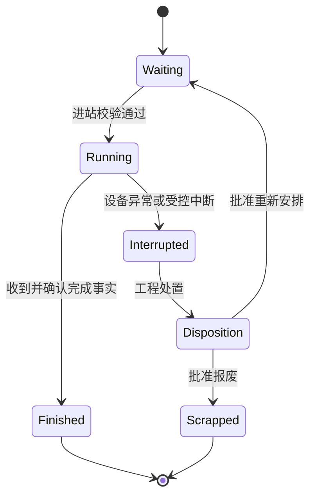

# 2.0实务三：MES事务、工程变更与新品导入

[返回知识库](../README.md) · [完整案例](01-end-to-end-case.md)

> 全文状态名、字段、权限和验收为产品设计建议，不是SEMI报文字段或任何企业既有实现。工艺参数、放行依据与操作权限必须由客户工程和质量体系定义。

## 1. 不要把批次、任务、设备、质量压成一个状态

一批晶圆可以“等下一工序”，同时被质量Hold；它的旧任务可以被取消，但Lot仍然存在；设备维修结束，也可能没有恢复该工序资格。

| 状态维度 | 示例值 | 谁主要维护 |
|---|---|---|
| Lot生命周期 | created、active、completed、scrapped、closed | MES业务事务 |
| 工序执行状态 | waiting、running、finished、interrupted | 现场和设备事件 |
| 质量限制 | active_holds列表，而非一个覆盖全部原因的布尔值 | 工艺与质量授权流程 |
| 派工任务 | proposed、released、accepted、running、completed、cancelled、failed | 调度与执行协同 |
| 设备状态 | 可用、运行、维护、故障、工程使用等客户定义状态 | 设备及维护系统 |
| 加工资格 | 有效、暂停、待复资格、失效及生效时间 | 工艺资格管理 |

解除一个Hold不等于解除所有Hold。取消任务也不能被解释为取消订单或删除Lot。

## 2. 一次加工的状态机



此图描述工序实例；质量限制独立保存。若处置要求返工，则创建对应的新访问实例，不把历史Running记录改成从未发生。某些工艺可以恢复、另一些必须报废或重做，不能由此图统一决定。

## 3. 业务事务规格表

| 事务 | 前置条件 | 成功后的变化 | 必须拒绝或转处置的情况 |
|---|---|---|---|
| 创建Lot | 产品、路线、晶圆身份和数量有效 | 绑定工程版本，建立谱系起点 | 晶圆已被另一个活动Lot占用或版本未批准 |
| 进站Track-in | 工序正确，无阻断Hold，设备/配方/工具/材料有效 | 创建运行实例，锁定必要资源，记录实际开始 | 旧任务、资格已失效、资源冲突、时间窗不满足 |
| 出站Track-out | 对应运行实例和可核对的完成事实 | 记录完成、质量/数量、释放资源、推进允许的路径 | 无进站记录、事件对应错误实例、数量不一致 |
| 加Hold | 有明确原因、范围、授权 | 新增限制，不覆盖已有Hold | 普通用户无权暂停该范围 |
| 解Hold | 处置依据有效，指定Hold具备放行条件 | 解除该限制，重新计算可执行性 | 其他Hold仍存在；不能一键宣称全批可生产 |
| 拆批 | 工艺和状态允许，晶圆归属明确 | 父子谱系、数量及需求贡献重新分配 | 加工中不允许拆批；重复分配同一片晶圆 |
| 合批 | 产品、工序、版本、限制等兼容且规则允许 | 新归属及父批关联，保留追溯 | 只因产品同名就合批，或丢失个体限制 |
| 返工 | 经批准路线、次数与适用范围 | 新工序访问和新增负荷 | 覆盖原历史、无限返工、漏算设备时间 |
| 报废 | 授权确认、原因与数量清楚 | 减少可供贡献并通知计划 | 为修账直接删除晶圆记录 |
| 纠错/冲正 | 有原事务、证据和权限 | 追加纠错记录，重新对账 | 物理加工不可撤销却被系统当作未加工 |

对未完成检验的出站，工序加工可以完成，但Lot进入受控等待或Hold；不要把“加工完成”和“质量放行”绑定为同一个必然事件。

## 4. 数量守恒与谱系演练

### 4.1 拆批

Lot X有25片，允许拆成X1的15片和X2的10片。每片晶圆只保留一个当前活动归属，历史归属不删除。X1与X2继承哪些Hold、配方限制和订单分配，由规则明确。

假设X1又报废2片：当前可用晶圆为13＋10＝23片，累计报废2片，合计25片。订单预期供给随之重算，不能仍按25片预测成品。

### 4.2 加工次数不等于产出数量

若X2的10片返工一次，该工序发生20片次加工，但仍是10片实物。设备负荷按加工片次与时间计，WIP按实际片数计。Fab-out更不能把返工经过工序的片次当成新增晶圆。

### 4.3 一条最小事件

```json
{
  "event_id": "DEMO-E0008",
  "event_type": "TRACK_OUT",
  "source_system": "DEMO-EAP",
  "occurred_at": "2026-09-09T13:30:00+08:00",
  "received_at": "2026-09-09T13:30:03+08:00",
  "lot_id": "B",
  "step_id": "PHOTO-120",
  "visit_no": 1,
  "task_id": "T-B-03",
  "equipment_id": "P02",
  "route_version": "R1",
  "recipe_version": "RP1",
  "input_qty": 25,
  "processed_qty": 25,
  "scrap_qty": 0,
  "unit": "wafer",
  "quality_release_status": "PENDING"
}
```

该事件中的processed_qty是加工完成量，不代表最终良品Die；质量尚待确认。需要配套事件唯一性和工序实例唯一性，避免设备用不同event_id重复报告同一物理完成时仍重复入账。

## 5. 一致性故障必须怎样处理

| 情况 | 建议处理 |
|---|---|
| 同一事件重复 | 幂等返回已处理结果，不重复增减数量 |
| 不同事件号指向同一完成 | 检查任务/工序实例和设备作业标识，发现冲突进入对账 |
| 出站先于进站消息到达 | 暂存或标记待对账，结合设备历史确认；不盲目推进下一步 |
| 本地取消时设备已开工 | 拒绝把物理加工“取消掉”，转运行状态核对和工程处置 |
| 新版计划替代旧版 | 未执行任务按规则撤销，已运行任务保留；历史版本可追溯 |
| 系统重启 | 从已确认状态与设备事实恢复，区分已做未报和未做已派 |
| 跨系统数量不一致 | 明确权威事实来源与核对窗口，禁止简单用最后写入覆盖一切 |

## 6. 新产品导入NPI：从工程试验到稳定量产

下面为通用调研与产品设计阶段，不是企业统一标准流程。

| 阶段 | 业务目标 | 系统需要支持 | 进入下一阶段的证据 |
|---|---|---|---|
| 工程准备 | 确认路线、材料、测试和目标 | 工程版本、未关闭问题、试验计划 | 指定角色批准试验条件 |
| 工程批 | 验证工艺假设 | 工程批身份、实验分支、受控参数和追溯 | 数据完整，问题有处置结论 |
| 设备/工艺资格 | 明确哪些资源可稳定加工 | 资格矩阵、有效期、试片与复测 | 合格证据及批准 |
| 小规模爬坡 | 验证产能、良率和交付预测 | 分版本良率、时间分布、例外记录 | 达到企业定义的阶段指标 |
| 扩大量产 | 增加能力且保持受控 | 产品换代、更多合格资源、物料协同 | 运营、工程与质量共同确认 |
| 稳定量产 | 稳定交付和持续改进 | 基线监控、变更管理、追溯 | 持续监控，不等于以后不需验证 |

排产影响：工程批会占用生产机台，可能需要专人、特殊材料和检测；其加工时间与良率不应照搬成熟产品。试验完成后设备可能需要清洁、恢复和重新确认生产资格，不能把实验结束时刻直接当成可生产时刻。

SLIM-O曾用于产品换代和资格规划，这属于论文事实；上述现代NPI阶段和字段是补充方案。参见[SLIM原文pp.70–71](https://pubsonline.informs.org/doi/10.1287/inte.32.1.61.15)。

## 7. 路线或配方升级如何影响在制品

**教学场景**：R1升级R2，新版在某步增加检测。系统不能把全部活动Lot的route_version批量改成R2后结束。

1. 列出尚未投料、已投料未到变更点、已通过变更点、已完工和已发运的对象。
2. 工程定义哪些Lot从哪里切换，哪些继续R1，哪些暂停等待评估。
3. 为适用Lot增加新访问或路线生效映射，保留原执行历史。
4. 重算工时、资格、测试资源和交付影响；不要只更新图纸链接。
5. 对已下发未执行任务更新版本；设备端选择配方前再次核对。
6. 确认旧料、旧配方和旧任务不会被误用，记录变更闭环证据。

## 8. 验收必须有反例

| 编号 | 验收输入 | 预期 |
|---|---|---|
| M01 | 有两条Hold，只解除一条 | 仍不可进站，并显示剩余原因 |
| M02 | 已撤销的V1任务请求开工 | 拒绝并提示当前有效版本 |
| M03 | 维修完成，工艺资格待确认 | 不把设备加入该工序可选资源 |
| M04 | 25片拆成15＋10，又有2片报废 | 当前23，报废2，追溯完整 |
| M05 | 同一加工完成重复上报两次 | 只推进一次、只计一次数量 |
| M06 | 10片返工一次 | 20片次工作量，10片实物 |
| M07 | 新版路线不适用于某旧批 | 保留批准的旧版执行，不强制升级 |
| M08 | 完成加工但质量待确认 | 不把它当已放行成品 |

接口背景可参阅[SEMI设备正常运行场景](https://www.semi.org/sites/semi.org/files/2020-08/AUX013-00-0705.pdf)。该材料不覆盖完整异常管理；本文事务规格不能被误称为标准原文。
