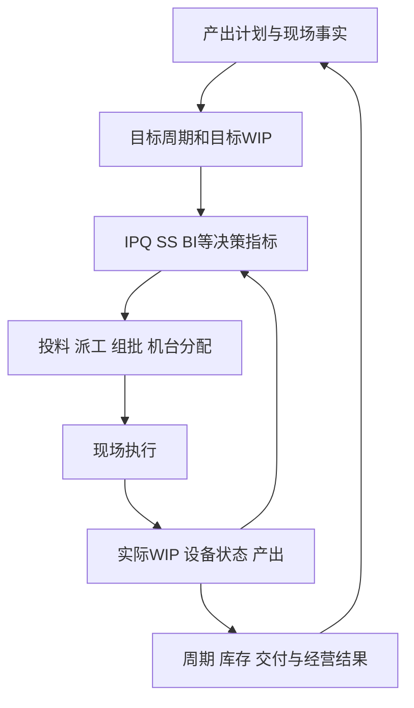
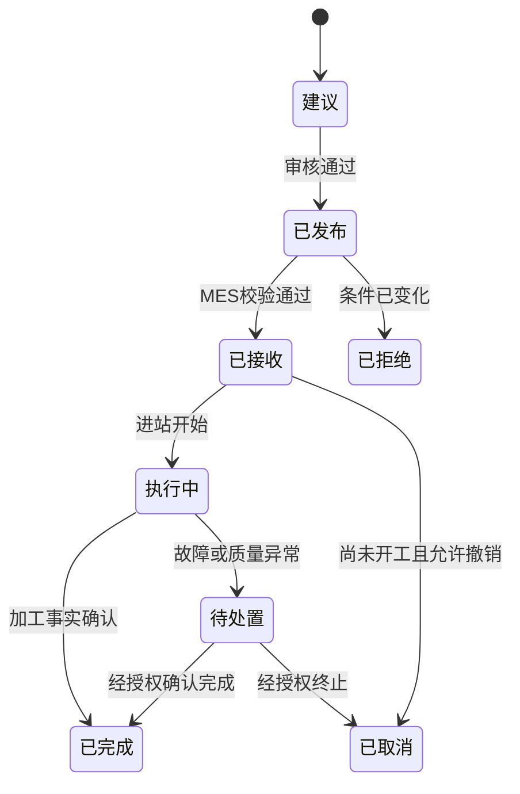
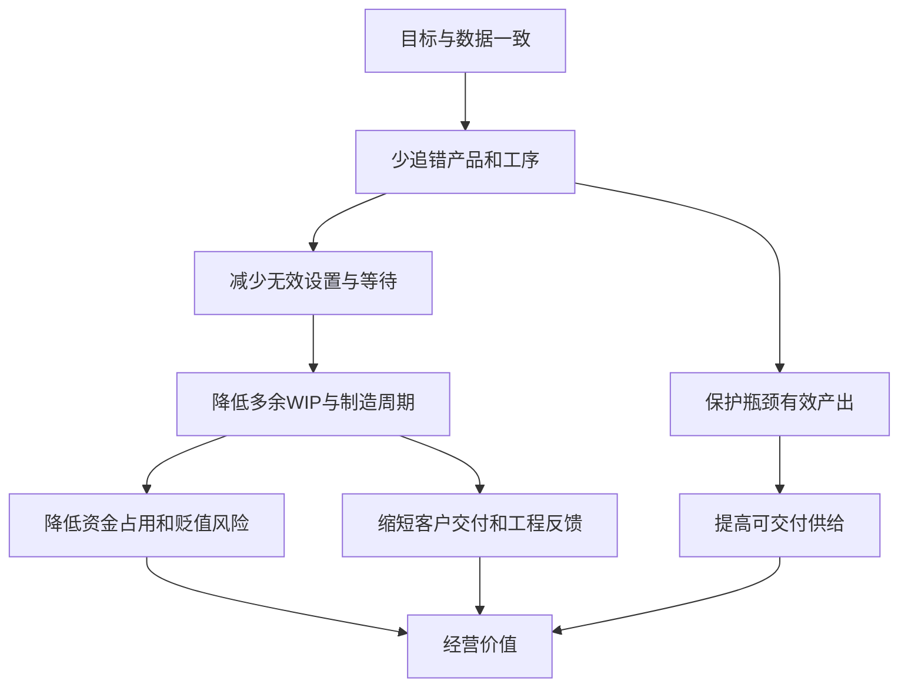

# 2.1专题：SLIM的数据自动化、算法、用户与业务价值

[返回知识库](../README.md) · [完整业务案例](01-end-to-end-case.md) · [排程与验证](02-scheduling-and-variability.md) · [MES事务](03-mes-and-npi.md)

> 本文基于用户提供的SLIM PDF整理，原文为Leachman、Kang和Lin于2002年发表的三星案例。文中“论文事实”“产品化补充”“教学示例”分别标明，避免把现代MES功能或推测写成论文原有能力。

## 1. 先回答：仅靠这份PDF够不够

| 要回答的问题 | PDF覆盖度 | 能从论文确认什么 | 产品化还要补什么 |
|---|---:|---|---|
| 为什么缩短周期、降低WIP | 高 | 市场、库存贬值、交付与竞争压力 | 当前客户损失基线与投资回报 |
| 如何计算生产目标 | 高 | 目标周期、目标WIP、IPQ、SS、BI | 字段口径、数据质量、版本和计算服务 |
| 如何投料、派工、组批和做产能分析 | 高 | M/L/S/D/I/F/O七个模块 | 现代求解架构、性能要求和验收 |
| 哪些角色参与 | 中 | 制造、生产控制、光刻工程、IE、系统技术与管理层 | 每个角色的页面、权限、审批和交接 |
| 状态怎样流转 | 中低 | 论文考虑设备不可用、Hold和资格变化 | Lot、任务、质量、设备状态机及恢复事务 |
| 系统怎样连到设备 | 低 | 在线数据库、建议模式、排程与仿真 | MES、EAP、设备、搬运接口和消息异常 |
| 自动化节省多少人工 | 低 | 自动形成决策支持和管理闭环 | 工时基线、人工覆盖率和岗位收益验证 |
| 成本收益如何核算 | 中 | 历史周期、交付和收入估算 | 实施成本、库存资金、利润及因果归因 |

结论是：PDF足以讲清SLIM的业务方法和历史案例；完整产品方案要结合知识库中的MES状态、接口、权限、异常和验收设计。

## 2. 一条完整因果链



这条链的含义是：目标产出先被分解为各产品工序的合理进度和WIP，再生成现场决策；执行事实回来后继续计算。论文重点是目标、调度、投料、仿真和产能分析。任务从MES传到设备并完成加工，需要额外的执行与设备集成能力。

## 3. 数据自动化：系统需要什么数据

### 3.1 数据分类与责任

| 数据域 | 关键字段示例 | 论文中的用途 | 典型来源/责任角色 | 主要风险 |
|---|---|---|---|---|
| 需求与产出目标 | 产品、日期/时间桶、目标Fab-out数量、计划版本 | 目标WIP、IPQ和能力分析的起点 | 生产计划、运营 | 目标频繁变化或能力不可行 |
| 产品与工艺路线 | 产品/器件、工序、顺序、分支、剩余步骤 | 定义device-step及WIP位置 | 工艺/产品工程 | 路线版本错误，返工分支遗漏 |
| 周期与加工时间 | intrinsic cycle time、目标周期、process time | 分配目标周期、计算WIP与机台需求 | IE、工艺、历史数据 | 理想时间冒充实际稳定时间 |
| WIP与产出事实 | 产品、工序、Lot、数量、实际Fab-out | 计算实际进度、IPQ和BI | MES、制造 | 延迟、重复、位置与数量错误 |
| 良率 | 各工序到Fab-out的计划良率 | 将不同位置的数量换到相同口径 | 工艺、质量、计划 | 重复折损或旧良率未更新 |
| 设备与日历 | 设备、状态、班次、维护、可用时间 | 可行派工、仿真和能力 | 设备工程、设备系统 | 预计恢复被当成已经恢复 |
| 加工资格 | 产品＋工序＋设备、有效期、历史关联 | 判断某批能在哪台设备做 | 工艺工程 | 把同型号设备当成完全同质 |
| 掩模与工具 | 掩模、兼容机台、数量、位置、占用 | 光刻机与掩模协同排程 | 光刻工程、工具管理 | 同一资源重复占用 |
| 运行参数 | 班次窗口、最小批量、设置、优先等级 | L/S/D/I的调度规则 | 调度、IE、制造 | 参数无版本、现场私自修改 |

“来源”是典型产品架构建议，并非三星论文公布的系统字段归属。实际项目要确定每个字段的权威系统、更新频率、生效时间和维护权限。

### 3.2 数据怎样变成可执行决策

| 层次 | 系统处理 | 产出 | 失败时应怎样表现 |
|---|---|---|---|
| 数据接入 | 获取计划、WIP、设备、资格、良率等 | 带时间与版本的数据快照 | 标记缺失、延迟和冲突，不静默补默认值 |
| 业务校验 | 检查单位、路线位置、资格有效性和数量关系 | 可计算数据集 | 告知对象、字段、责任来源和影响 |
| 指标计算 | 计算目标WIP、IPQ、SS、BI、MNM | 产品工序目标与紧急程度 | 保留公式版本、输入快照和异常原因 |
| 方案生成 | 过滤不可行组合，安排投料、派工、组批或机台 | 推荐方案与未排原因 | 目标不可行时展示冲突条件 |
| 人工审核 | 查看原因、影响，按权限调整或发布 | 有效计划版本 | 记录覆盖人、原因、时间和影响 |
| 执行反馈 | 获取接受、进站、完成、故障、Hold等事实 | 最新WIP和资源状态 | 对重复、乱序、超时和断网进行对账 |
| 偏差分析 | 比较计划、仿真与实际 | 数据、算法或执行问题分类 | 进入责任人明确的纠正流程 |

## 4. 状态设计：论文提到哪些，产品还缺哪些

SLIM论文说明设备会因维护、工程活动、维修和复资格不可用，Lot或工序也可能被Hold，机台资格会变化。这些事实会改变可行排程。论文没有提供一套完整状态机，因此产品需要分别管理以下状态。

| 状态对象 | 最小状态示例 | 为什么必须独立 |
|---|---|---|
| Lot | 已创建、活动中、已完成、已报废 | 描述生产对象的总体生命周期 |
| 工序实例 | 等待、加工中、完成、中断、待处置 | 同一Lot可能多次进入同类工艺或返工 |
| 质量限制 | 一条或多条Hold、已解除 | 解除一条原因不代表全部放行 |
| 调度任务 | 建议、已发布、已接收、执行中、完成、取消、失败 | 计划发布不等于现场已经开工 |
| 设备 | 待机、运行、维护、故障、工程使用等 | 空闲不等于具备特定工序资格 |
| 加工资格 | 有效、暂停、待复资格、失效 | 维修完成不等于工艺资格恢复 |
| 计划 | 草稿、已审核、已发布、已取代 | 防止现场继续执行旧版本 |



这是产品化补充，用来解释排程结果怎样受控执行，不是SLIM原文状态图。

## 5. 五个核心指标与公式

### 5.1 目标WIP：库存应该放在哪里

业务直觉的简化式为：

```text
目标WIP ≈ 目标产出速率 × 分配给该工序的目标停留时间
```

论文实际根据未来连续时间Fab-out计划、从各工序到Fab-out的剩余目标周期和计划良率积分计算。它回答“该产品在该工序位置应该保留多少WIP”。

| 项目 | 说明 |
|---|---|
| 使用原因 | 仅看库存数量无法判断是合理缓冲还是无效堆积 |
| 使用场景 | SLIM-M将产品产出目标分解到各工序 |
| 决策输出 | 各产品工序的目标WIP分布 |
| 主要用户 | 生产计划员、IE、制造主管 |
| 业务价值 | 让全线围绕同一库存结构协作，为低WIP和稳定供料建立基准 |
| 边界 | 目标WIP不是投料量，也不是仓库安全库存；目标产出必须与瓶颈能力一致 |

**教学示例**：目标速率100片/天，某工序分配0.5天目标停留时间，忽略良率和计划波动时，目标WIP约50片。

### 5.2 IPQ：这一班理想上应该做多少

业务直觉可以写成：

```text
IPQ ≈ 截至目标时点的应有累计产出
      − 已实现的实际产出
      − 下游现有WIP预计可贡献的产出
```

各项按从当前工序到Fab-out的计划良率换算到同一数量口径。论文公式使用当前工序到Fab-out的目标周期，并将目标窗口延伸一个班次（0.33天）。

| 项目 | 说明 |
|---|---|
| 使用原因 | 只知道“落后”仍不知道本班应补多少，以及何时停止继续做该产品 |
| 使用场景 | SLIM-M计算生产目标，L/S/D/I等模块使用 |
| 决策输出 | 产品＋工序在当前班次的理想生产数量 |
| 主要用户 | 计划员、调度员、制造主管、班组长 |
| 业务价值 | 防止过量生产某个产品工序，同时补足真正的产出缺口 |
| 边界 | IPQ可能为负，也可能因无料、能力或资格而无法完成；它不是承诺产量 |

**教学示例**：应有累计产出100片，已完成20片，下游WIP预计贡献50片，在忽略良率差异时，IPQ为30片。

### 5.3 SS：谁相对计划更着急

论文用IPQ除以相应时间区间内的平均Fab-out速率并改变符号，把数量差距转成时间尺度的计划得分：

```text
SS ≈ − IPQ / 平均目标产出速率
```

| 项目 | 说明 |
|---|---|
| 使用原因 | 不同产品正常产量差异很大，直接比较缺多少片不公平 |
| 使用场景 | SLIM-L等模块比较产品工序的计划进度 |
| 决策输出 | 以时间/班次尺度表示的相对提前或落后程度 |
| 主要用户 | 调度员、制造主管、计划员 |
| 业务价值 | 把多产品缺口换成可比较的优先依据 |
| 边界 | SS比较的是产品＋工序，不是单个Lot等待时长；单位需在实现中统一 |

论文举例：SS＝−1表示该产品工序大致落后一个班次的正常产量。更低的SS表示更落后。

### 5.4 BI：通往下一瓶颈的供料是否不足

论文附录的区间从当前工序之后到下一个瓶颈工序，包含该瓶颈：

```text
BI = 区间Σ(实际WIP − 目标WIP) / 区间Σ目标WIP
```

| 项目 | 说明 |
|---|---|
| 使用原因 | 只追计划进度可能让下游瓶颈因缺少合适WIP而停等 |
| 使用场景 | SLIM-L结合SS和BI安排非瓶颈工序 |
| 决策输出 | 到下一瓶颈之间的相对供料差距 |
| 主要用户 | 调度员、IE、制造主管 |
| 业务价值 | 引导上游为瓶颈补充真正需要的产品工序，保护有效产出 |
| 边界 | BI是区间汇总，不证明每台设备都有合格Lot；还要检查资格和到达时间 |

BI＝0表示区间实际WIP与目标总量相同；BI＝−1表示该区间没有WIP。若目标WIP分母为零，产品实现必须定义异常处理。

### 5.5 MNM：为一个产品工序至少配置多少台机器

论文附录给出的业务直觉为：

```text
MNM = 向上取整(IPQ × 每片加工分钟 / 本班单台剩余可用分钟)
```

| 项目 | 说明 |
|---|---|
| 使用原因 | 调度系统可能让过多机台同时切换到同一产品工序，增加设置和分散任务 |
| 使用场景 | SLIM-L控制某产品工序应使用的机台数量 |
| 决策输出 | 完成IPQ所需的最小机台数量估计 |
| 主要用户 | 调度员、制造主管 |
| 业务价值 | 减少过度设置，同时保留其他产品工序的生产能力 |
| 边界 | 算出需要两台不代表存在两台合格可用设备；负IPQ和零剩余时间要单独处理 |

**教学示例**：IPQ为60片，每片5分钟，本班每台剩180分钟，则需要向上取整300/180，即2台。

## 6. 指标、算法模块、场景与价值的完整映射

IPQ、SS、BI和MNM是指标或中间决策量；M/L/S/D/I/F/O是方法与应用模块。二者处在不同层次。

| 模块 | 典型场景 | 解决的痛点 | 主要输入 | 自动完成的决策 | 主要用户 | 直接价值 |
|---|---|---|---|---|---|---|
| SLIM-M | 产出目标需要分解到数百道工序 | 不知道各位置应该有多少料、当前该补多少 | Fab-out计划、周期、良率、WIP、实际产出 | 目标周期、目标WIP、IPQ、SS等 | 计划、IE、制造管理 | 建立共同目标，减少按感觉追产 |
| SLIM-L | 非瓶颈机台准备接下一任务 | FIFO或只追Lot交期会做错重点并频繁切换 | SS、BI、IPQ、可用WIP、设备设置 | 产品工序优先级、设置及机台数量控制 | 调度、班组、制造主管 | 补计划缺口、向瓶颈供料、减少设置 |
| SLIM-S | 多台异构光刻机、资格和掩模共同受限 | 单台局部选批可能占用稀缺机台，留下无法匹配的WIP | IPQ/SS、资格、掩模、设置、WIP和设备 | 整体光刻机分配及甘特排程 | 光刻调度、制造、工艺 | 提高瓶颈有效利用和方案可行性 |
| sub-SLIM-S | 班次中持续有新WIP到达光刻区 | 原排程很快过时 | 当前甘特、到达WIP、未满足IPQ | 将紧急新WIP插入已有排程 | 调度、制造 | 及时响应状态变化 |
| SLIM-D | 扩散炉一次可处理1至6个Lot | 等满炉拖延，过早开炉浪费批处理能力 | 优先级、兼容工序、可用WIP、最小批量 | 构造兼容炉批或决定继续等待 | 炉区调度、班组 | 平衡周期与批处理效率 |
| SLIM-I | 每班或每天决定是否投新Lot | 有需求就投料会增加拥堵，并把负荷推向首个光刻瓶颈 | 起始工序IPQ、标准批量、首个光刻段未来能力 | 投料数量或阻止投料 | 生产计划、制造 | 从入口约束WIP，减少无效排队 |
| SLIM-F | 上线新规则、安排维护、检查执行偏差 | 不敢直接在真实工厂试，也难判断偏差来自哪里 | 实际WIP/设备状态、资格、计划、调度逻辑 | 离散事件仿真、方案比较、偏差监控 | IE、系统技术、设备和制造管理 | 降低试错风险，支持维护和问题定位 |
| SLIM-O | 产品换代、产品组合或资格能力变化 | 总体设备数看似够，具体产品工序仍在少数机台拥堵 | 分时需求、WIP、单机能力、资格、周期 | 线性规划的产能与产品组合方案 | 计划、IE、工艺、运营层 | 发现真实能力缺口，支持换代和资格规划 |

论文中的SLIM-S采用三遍启发式：先延续当前设置满足未完成IPQ，再安排新设置满足更多IPQ，最后分配剩余WIP以利用能力。启发式追求业务可用的好方案，并不等于数学上证明全局最优。

SLIM-O使用线性规划，将分期需求、WIP流动、单机能力、资格、欠交和成品库存写成变量、约束和目标。它适合中长期能力与换代分析，不等同实时派工。

SLIM-F使用离散事件仿真，让虚拟工厂按事件推进，用于比较策略、支持维护窗口及发现实际与模拟流动的偏差。仿真用于验证和分析，并不会自动寻找最优策略。

## 7. SLIM自动化了哪些流程

### 7.1 论文支持的自动化范围

| 自动化环节 | 过去可能依赖的工作 | SLIM形成的自动化或决策支持 |
|---|---|---|
| 目标分解 | 管理者按月目标和经验追赶重点Lot | 将Fab-out目标分解为产品工序目标周期、WIP和IPQ |
| 进度判断 | 逐批查看年龄、截止日期或月底cutoff | 以产品工序SS比较整体进度 |
| 瓶颈供料 | 人工巡视哪里缺料 | 用BI识别通向下一瓶颈的WIP不足 |
| 非瓶颈派工 | 设备空闲后凭经验选批 | L生成产品工序优先级并限制过度设置 |
| 光刻排程 | 各机台局部安排，人工协调资格与掩模 | S整体安排光刻机和掩模，sub-S处理新到WIP |
| 扩散组批 | 人工等待和凑批 | D按优先级、兼容性和最小批量组炉 |
| 新Lot投料 | 产出计划后移或为保持忙碌而提前投料 | I结合起始缺口及首个光刻能力控制投料 |
| 能力规划 | 按设备类型汇总能力 | O在产品工序和单机资格层面评估能力 |
| 策略验证 | 直接上线后观察结果 | F用实际工厂状态做离散事件仿真 |
| 执行监控 | 难以发现是否偏离新方法 | F比较实际WIP移动与模拟结果，支持查因 |

### 7.2 仍需要人完成的决策

- 管理层确定业务目标、产品组合、资源投资和风险边界。
- 生产计划员确认需求与目标产出，处理不可行计划和交期承诺。
- 工艺工程师批准路线、Recipe和设备资格，处理Hold与复资格。
- 设备工程师维修、维护并提供恢复信息；工艺资格恢复另行确认。
- 调度与制造人员处理异常、审核建议、解释人工覆盖并组织执行。
- IE与系统技术人员维护时间模型、验证算法和诊断实际偏差。

论文采用过建议模式逐步上线，说明组织接受、培训和数据治理属于方法落地的一部分。它不支持“算法计算后无需人员和MES检查即可直接驱动设备”的说法。

## 8. 角色协作：每个人获得什么价值

| 角色 | 原有痛点 | SLIM/系统提供的帮助 | 人的关键动作 | 可验证指标 |
|---|---|---|---|---|
| 生产计划员 | 月度目标难以下沉，投料和产出脱节 | 目标WIP、IPQ、投料和产能方案 | 确认目标、处理不可行和改期 | 计划达成、投料偏差、OTD |
| 调度员 | 多产品、多机台和资格难以人工统筹 | 优先级、机台分配、组批和原因 | 审核异常、发布、记录覆盖 | 推荐可执行率、覆盖率、设置次数 |
| 制造主管 | 各区域只追局部产量 | 产品工序目标及全线偏差 | 跨区协调、批准例外、复盘 | 班次达成、瓶颈缺料、计划稳定性 |
| 班组长/操作员 | 不清楚为什么插单或换机 | 当班任务、原因和顺序 | 确认实物、执行、反馈现场条件 | 任务接收、执行偏差、异常响应 |
| 工艺工程师 | 资格变化和工艺限制难以及时影响计划 | 把资格和Recipe限制纳入可行性 | 审批、Hold处置、复资格 | 无资格误派、工艺异常、放行时间 |
| 设备工程师 | 维修和PM可能打乱生产 | 仿真维护时机、能力影响和重排 | 更新状态、修复预测和维修事实 | 故障影响时长、恢复预测偏差 |
| IE工程师 | 目标周期和瓶颈依赖经验 | M/F/O提供分析和校准手段 | 测时、校准、试验和效果归因 | 周期分布、WIP、模型误差 |
| 厂长与运营层 | 产量、交付、库存和投资相互冲突 | 产品组合、能力缺口和经营结果视图 | 设目标、批准资源和跨部门策略 | 交付、周期、库存、良率、收益 |

论文没有逐角色量化节省多少人工工时。上表中的岗位收益和指标属于产品化的验收建议，应在客户项目中建立基线后验证。

## 9. 增效、降本和经营价值如何形成



| 价值层次 | 价值来源 | 项目中应怎样测 |
|---|---|---|
| 人员增效 | 自动汇总、计算、推荐和异常定位 | 计划准备工时、人工表格数、跨部门确认次数 |
| 协作增效 | 计划、制造、工艺、设备和IE使用同一快照与目标 | 争议关闭时间、人工覆盖原因完整率、异常响应时间 |
| 生产增效 | 减少不必要切换、错误占机和瓶颈缺料 | 设置次数、有效加工时间、瓶颈缺料时间、吞吐 |
| 库存降本 | 降低无效WIP与等待 | WIP片数/价值、工序分布、老化和持有成本 |
| 交付价值 | 缩短制造周期和提高准时交付 | Cycle Time分布、OTD、请求与承诺日期分开统计 |
| 工程价值 | 更快获得试验和客户变更反馈 | 实验周转时间、问题关闭周期 |
| 资本价值 | 更准确识别是否真的需要扩机或增加资格 | 延缓投资金额、资格成本、约束解除后的产出变化 |
| 经营价值 | 在价格变化中更早形成可销售供给 | 经财务确认的增量收入、毛利和归因范围 |

降低WIP可能释放一次性营运资金，也可能持续减少持有、损耗或贬值成本；两者不能重复计作年度利润。设备利用率上升也不是最终价值，必须同时观察良率、交付、周期和WIP。

## 10. 原论文结果与表述边界

| 论文结果 | 面试中可以怎样说 | 不能怎样说 |
|---|---|---|
| DRAM制造周期从80多天降到30天以内 | SLIM项目与组织改革期间取得显著周期改善 | 所有工厂上线后必然降到30天 |
| 代表性产线达到约1.3至1.6天/层 | 历史案例中周期达到先进水平 | 当前行业统一标准就是该数值 |
| 光刻区域WIP占比通常提高约10至15 percent | WIP被重新配置到更能保护瓶颈的位置 | 全厂WIP增加10至15个百分点 |
| 一次21班次仿真中光刻吞吐约高12% | 特定上线前模拟显示该策略有潜力 | 全厂实测吞吐普遍提高12% |
| EDS OTD 70%升至96%，Test OTD 74%升至98% | 后段推广阶段也报告准交改善 | 仅靠前道光刻算法直接造成全部提升 |
| DRAM增收估算约9.54亿美元，相关产出折算约11.33亿美元 | 周期缩短在价格下降环境下保留了可观销售收入 | 这是利润，或全部由算法单独产生 |
| DRAM市场份额18%升至22% | 项目期间公司竞争表现增强 | 市场份额变化可完全归因于SLIM |

## 11. 面试可直接使用的三分钟表达

> SLIM面对的核心问题，是半导体流程有数百道工序、设备资格复杂、同一设备区被反复访问，加上故障、维护和Hold，使WIP容易堆错位置。过去若只追每个Lot的交期或设备利用率，可能让整条线更拥堵。
>
> 它先用Fab-out计划、目标周期、良率和现场WIP，计算各产品工序的目标WIP与IPQ；SS回答谁相对计划更落后，BI回答通往下一瓶颈的供料是否不足。随后L调度非瓶颈、S安排光刻机和掩模、D处理扩散组批、I控制新Lot投料；O做分时能力分析，F通过离散事件仿真验证策略和监控偏差。
>
> 自动化的核心，是把目标分解、库存判断、优先级、组批、投料和能力分析变成持续的数据决策。生产计划、调度、制造、工艺、设备和IE因此使用共同的目标与状态协作。现场执行仍需MES、设备集成和人的权限检查。最终价值来自减少错误追产、无效设置、等待和多余WIP，同时保护瓶颈产出，从而改善周期、交付与经营结果。

## 12. 高频追问与回答要点

| 追问 | 回答要点 |
|---|---|
| IPQ和目标WIP有什么区别？ | 目标WIP是某位置应维持的库存基准；IPQ是当前窗口为恢复目标产出进度应加工的理想数量 |
| SS和Lot优先级是不是一回事？ | SS属于产品工序层的计划进度指标；具体Lot仍需满足工序、资格、Hold、资源和其他规则 |
| 为什么既降低库存又增加光刻区WIP占比？ | 总量和结构是两个维度；减少无效堆积，同时把必要缓冲配置在瓶颈附近 |
| BI低是不是一定先做？ | 它表示瓶颈供料紧张，还要与SS、可用WIP、资格和设置等一起判断 |
| SLIM会直接控制机器吗？ | 论文主要是计划调度和决策支持；机器执行还需要MES、设备集成、资源校验和现场流程 |
| 为什么不用一个最优算法全部解决？ | 实时派工、批处理、光刻分配、长期产能和仿真是不同时间尺度与问题结构，需要不同模块 |
| 算法推荐无法执行怎么查？ | 先查快照时效，再查路线/Hold/资格/材料/工具/设备，随后检查目标可行性、规则遗漏和现场变化 |
| 怎样证明降本？ | 建基线并分别计算人员工时、设置损失、WIP资金、持有成本、产出和交付；保护良率并说明归因边界 |

## 13. 产品验收清单

- 同一计算结果能追溯到计划版本、WIP快照、资格、设备状态、参数和算法版本。
- 无资格、被Hold、资源冲突或数据过期的任务不能进入可执行队列。
- IPQ为负、目标WIP为零、没有下一瓶颈、设备恢复预测变化等边界有明确处理。
- 推荐展示原因、未排原因和被影响的订单/产品工序。
- 人工覆盖需要权限、原因、时间、有效范围和影响记录。
- 计划发布、MES接收、实际开工、实际完成与质量放行分别记录。
- 重复、乱序、超时和断网恢复不会造成重复加工或重复产出。
- 历史回放只使用当时可知信息，试点同时观察周期、WIP、产出、良率与计划稳定性。
- 收益由业务和财务确认口径，区分历史相关、可归因改善与外部变化。

## 14. 证据来源

- Robert C. Leachman, Jeenyoung Kang, Vincent Lin, 2002, [SLIM: Short Cycle Time and Low Inventory in Manufacturing at Samsung Electronics](https://pubsonline.informs.org/doi/10.1287/inte.32.1.61.15), *Interfaces* 32(1):61–77。本文的模块、公式含义、实施过程和历史结果以用户提供PDF全文为主要依据。
- 本知识库[完整业务案例](01-end-to-end-case.md)、[排程与验证](02-scheduling-and-variability.md)、[MES事务](03-mes-and-npi.md)提供产品化补充；其中状态、接口、权限、验收和教学数字不是SLIM论文原文。

