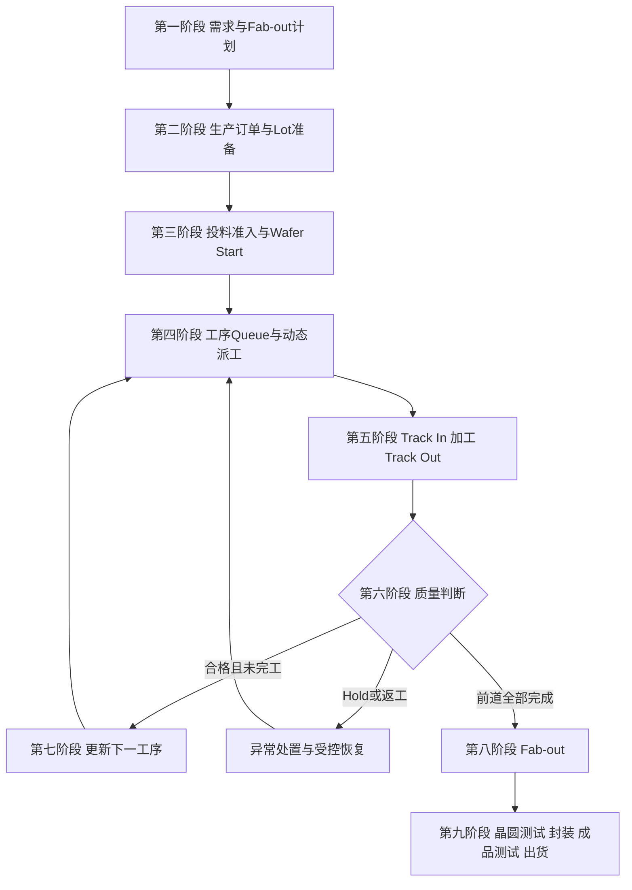
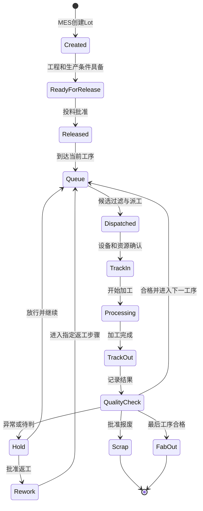
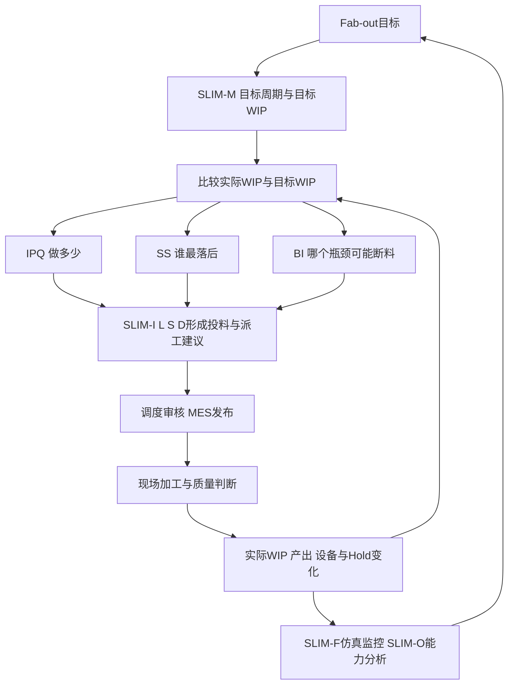
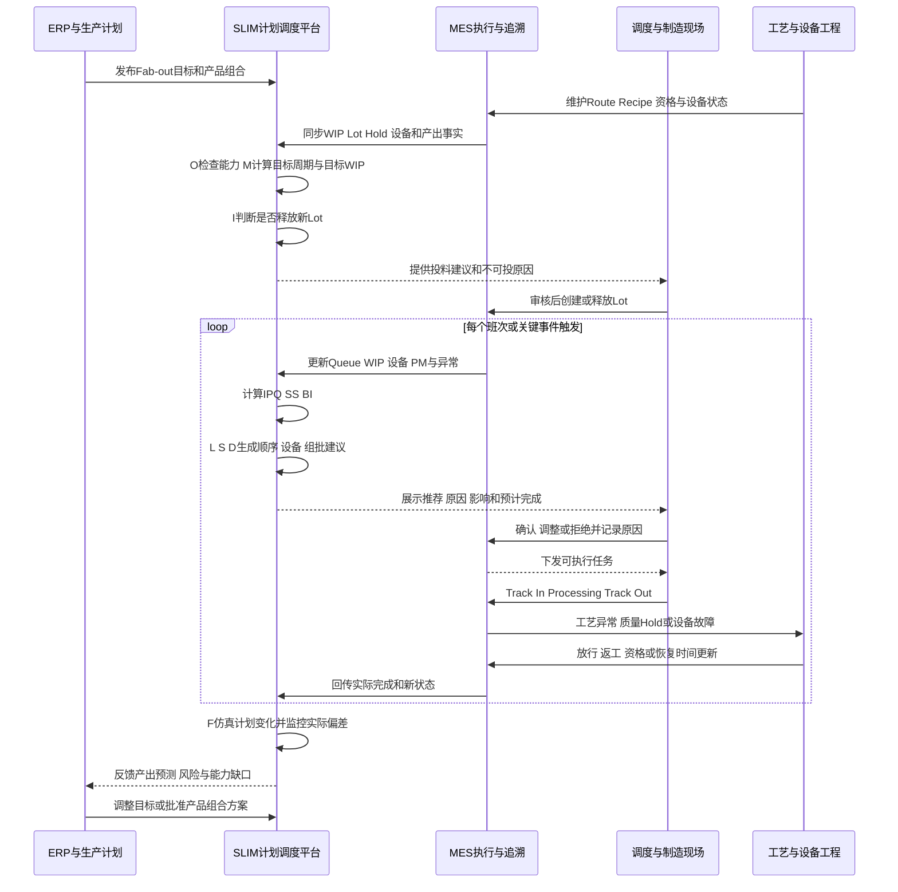
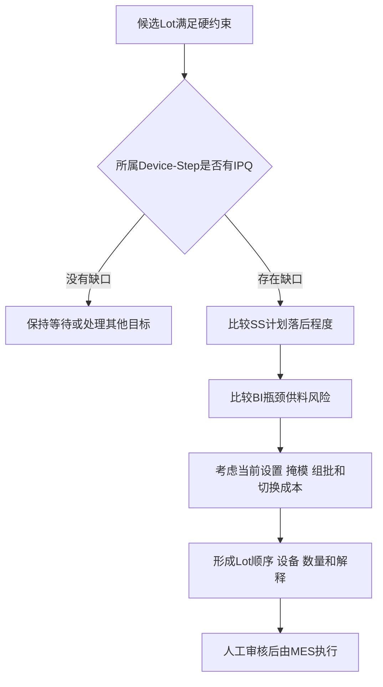
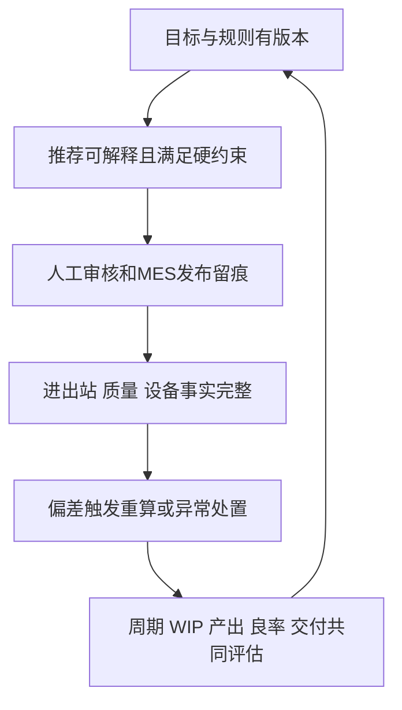

# 2.2专题：半导体生产状态、SLIM流动计划与完整泳道

[返回知识库](../README.md) · [SLIM数据自动化与算法](05-slim-data-automation-value.md) · [MES事务与状态](03-mes-and-npi.md) · [排程与验证](02-scheduling-and-variability.md)

> 本文把正常生产流程、单个Lot状态和SLIM滚动决策分开表达。SLIM论文支持的是目标WIP、投料、派工、光刻/扩散调度、产能分析、仿真与实施效果；文中的现代ERP、MES、EAP接口和审批状态属于行业化产品设计，需要按目标工厂核实。

## 1. 全局：生产是三个互相套住的循环

同一个Lot必须遵循获批Route的工序依赖，但不同Lot可处于不同工序，并在满足资格和资源约束时调整先后顺序。SLIM不改变工艺路线，而是在“何时投料、Queue里先做谁、用哪台合格设备、怎样保护瓶颈”上持续决策。

| 阶段 | 正常业务动作 | 核心状态/结果 | SLIM在其中的作用 |
|---|---|---|---|
| 1. 需求与计划 | 订单、预测、产品组合形成Fab-out目标 | 需求版本、目标日期、目标数量 | O做产能与产品组合分析；M把Fab-out倒推为各Device-Step目标 |
| 2. 订单与Lot准备 | 建生产订单，绑定产品、Route、数量和版本 | 订单已创建、Lot待释放 | 读取计划和工程条件，不替代ERP/MES建单事务 |
| 3. 投料 | 判断空白晶圆何时进入第一道工序 | Released、Wafer Start | I控制新Lot释放，防止入口WIP过量 |
| 4. Queue与派工 | Lot等待，过滤Hold、资格、Recipe、工具和设备条件 | Eligible、Dispatched | L/S/D依据IPQ、SS、BI及设置约束给出排序、设备和组批建议 |
| 5. 加工 | Track In、Processing、Track Out | 实际开始、完成、数量、设备与参数 | SLIM提供计划；MES/EAP/人员完成受控执行与事实记录 |
| 6. 质量判断 | 放行、Hold、返工、拆批或报废 | 下一步、异常处置或终止 | 新状态反馈后重算，SLIM不替代工艺/质量授权 |
| 7. 下一工序 | 更新Current Operation，再次进入Queue | 新工序位置与等待时间 | 重新计算该位置的计划差距和瓶颈供料风险 |
| 8. Fab-out | 前道全部工序完成 | 晶圆制造完工 | 与Fab-out目标核对，更新后续计划 |
| 9. 后段与交付 | Wafer Sort、Dicing、Assembly、Final Test、Packing、Shipping | Die/成品与交付结果 | 原SLIM案例还覆盖EDS与测试改善，但前后段对象和规则需分别建模 |

## 2. 单个Lot的完整状态图

### 2.1 状态转换不能只靠一个“完成”字段

| 转换 | 业务依据 | 关键校验 | 事实记录 |
|---|---|---|---|
| Created → ReadyForRelease | 生产订单、Route与版本生效 | 产品、晶圆数量、工程版本、材料/掩模条件 | 创建人、来源订单、版本快照 |
| ReadyForRelease → Released | 投料计划与准入批准 | SLIM-I建议、入口WIP、瓶颈能力、冻结规则 | 批准人、时间、计划版本 |
| Queue → Dispatched | 当前工序有可执行候选 | Hold、设备资格、Recipe、工具、批量、时间窗 | 推荐版本、原因、人工覆盖 |
| Dispatched → TrackIn | 现场与机台接受任务 | 设备状态、载具、材料、人员和互锁 | 实际设备、开始时间、操作者 |
| Processing → TrackOut | 设备完成并回传 | 数量、参数、报警、重复事件 | 完成时间、设备/腔体、实际参数 |
| QualityCheck → Queue | 工序合格且存在下一步 | 抽检结果、Route分支、下一工序 | 判定、下一位置、搬运目标 |
| QualityCheck → Hold/Rework/Scrap | 异常满足受控处置条件 | 权限、原因码、影响晶圆、返工路线 | 处置链、批次谱系、数量变化 |
| QualityCheck → FabOut | 最终前道步骤合格 | 全路线完成、数量与质量核对 | Fab-out时间、数量、良率口径 |

## 3. SLIM与正常生产如何共同流动

SLIM的流动计划不是让每批晶圆都按固定时间表机械前进，而是不断比较“应当在哪里”和“实际在哪里”，把有限加工能力引导到真正的计划缺口与瓶颈供料缺口上。

## 4. 完整泳道图：从计划到执行再到重算

### 4.1 五条泳道的责任边界

| 泳道 | 是什么的事实源 | 核心动作 | 不能越权做什么 |
|---|---|---|---|
| ERP与生产计划 | 需求、承诺、Fab-out和计划版本 | 定目标、调产品组合、处理能力缺口 | 不能把不可行目标直接当成现场可执行任务 |
| SLIM | 计算快照、指标、推荐和仿真版本 | 目标分解、投料、优先级、组批、设备分配建议 | 不直接证明质量合格，不天然等于设备控制系统 |
| MES | Lot、工序、Hold、进出站与生产事实 | 校验并发布任务、记录事务、追溯 | 不应静默执行不合格机台或过期版本建议 |
| 调度与制造现场 | 推荐采纳、人工覆盖和真实作业 | 审核、协调、执行、报告异常 | 不能绕开Route、资格、质量与权限控制 |
| 工艺与设备工程 | Route/Recipe/资格、设备状态和处置依据 | 工艺放行、返工判断、故障恢复、资格维护 | 不单方面更改客户承诺或全厂产品组合 |

## 5. 示例：为什么“WIP位置正确”比“总量很多”更重要

**教学示例，不是论文原始数据。** 假设未来每天需要Fab-out 100片某产品：

| Device-Step | 目标WIP | 实际WIP | 差异 | 初步判断 |
|---|---:|---:|---:|---|
| 光刻1 | 100 | 120 | +20 | 已超目标，不应仅因队列大而继续追产 |
| 刻蚀1 | 80 | 30 | -50 | 供给不足，需要识别可推进的上游Lot |
| 光刻2 | 120 | 20 | -100 | 严重缺口，可能使关键设备未来断料 |
| 测量2 | 40 | 90 | +50 | 已堆积，应检查下游吸收能力 |

传统局部做法可能看“哪台设备空、哪个Queue的Lot多”就继续加工。SLIM会结合IPQ、SS和BI识别真正缺口，并优先推进能够经过合法Route补给光刻2的上游Lot。

这里有一个重要边界：不能把光刻1后的Lot直接跳到光刻2，也不能只看上表就断言某一个Lot一定优先。实际派工仍要检查当前工序、Hold、设备资格、Recipe、掩模、批量、时间窗和设置状态。

## 6. SLIM具体怎样实现短周期和低库存

| 手段 | 系统怎样做 | 解决的浪费/痛点 | 对周期和库存的作用 |
|---|---|---|---|
| 1. 从Fab-out倒推 | 将未来产出目标分解到各Device-Step | 只管入口投多少，不知道中间应有多少 | 让WIP数量和位置服务最终产出 |
| 2. 设置目标周期 | 为各步骤分配目标周期，把必要缓冲放在关键位置 | 所有步骤平均留库存，或完全没有保护缓冲 | 压缩无效等待，同时保护瓶颈连续运行 |
| 3. 计算目标WIP | 结合目标产出速率、目标周期和良率形成位置基准 | 只看总WIP，无法发现局部缺料和堆积 | 控制总量并重构WIP分布 |
| 4. IPQ决定做多少 | 计算当前窗口为恢复计划应完成的数量 | 有产能就无限做，形成过量生产 | 补到目标即转向其他缺口 |
| 5. SS判断谁落后 | 把产品工序的进度差换算成近似班次差 | 只追单个Lot或只看队列长短 | 优先恢复Fab-out计划，而非制造表面忙碌 |
| 6. BI保护瓶颈 | 衡量到下一瓶颈之间实际WIP相对目标的不足 | 瓶颈因上游供料不足而空闲 | 在真正需要的位置保留有限缓冲 |
| 7. 限制设备切换 | 按Device-Step组织，考虑设置、掩模和最少设备数 | 频繁换Recipe、掩模、清洁和确认 | 减少切换损失与等待，又避免全设备扎堆同一产品 |
| 8. 控制新Lot投入 | 入口WIP足够或未来瓶颈无能力时暂停释放 | 前面已堵仍持续投片 | 从源头抑制过量WIP和周期膨胀 |
| 9. 滚动重算 | 在设备故障、Hold、新WIP和计划变化后更新推荐 | 静态月计划快速失效 | 缩短异常响应时间并保持计划可执行 |
| 10. 仿真与能力分析 | F比较策略和异常场景，O分析产品组合与资格能力 | 改计划后才发现产出受损 | 在执行前评估周期、吞吐和风险 |

### 6.1 目标周期不是设备加工时长

| 工序 | 纯加工及必要搬运 | 计划缓冲 | 目标周期 |
|---|---:|---:|---:|
| 清洗 | 2小时 | 0小时 | 2小时 |
| 刻蚀 | 4小时 | 0小时 | 4小时 |
| 光刻 | 3小时 | 8小时 | 11小时 |
| 测量 | 1小时 | 0小时 | 1小时 |

“光刻目标周期11小时”不是让Lot在光刻机里加工11小时，而是这个步骤的计划周期中包含为瓶颈波动准备的等待缓冲。实际分配方法要按论文模型、设备区特性和现场数据配置，不能把该教学数字当成行业标准。

### 6.2 IPQ、SS和BI如何共同决定派工

IPQ回答“做多少”，SS回答“谁更落后”，BI回答“谁若不做会威胁下游瓶颈”。它们是决策指标，不是绕过硬约束的通行证。

## 7. 多层级滚动计划

| 层级 | 典型问题 | 主要输出 | 是否应被下一层机械照搬 |
|---|---|---|---|
| 月/周产品组合 | 接多少需求，能力是否足够 | Fab-out、能力缺口、产品组合 | 否；要进一步转成可执行目标 |
| 日/班次计划 | 各Device-Step应推进多少 | 目标WIP、IPQ、风险列表 | 否；还要过滤现场硬约束 |
| 设备区排程 | 哪类任务在哪台设备、什么顺序 | 设备任务序列、组批、设置计划 | 否；执行前仍要看实时状态 |
| 实时派工 | 机器现在空闲，下一批做谁 | 当前可执行Lot与原因 | 是受控执行入口，但允许异常拒绝 |
| 事件重排 | 故障、Hold、插单或恢复后怎么办 | 新版本推荐及影响范围 | 必须经过版本、冻结和权限规则 |

“10分钟级动态插入”只能作为产品设计示例，不是SLIM论文给出的统一行业频率。实际刷新周期由设备节拍、数据时效、计算时间、计划稳定性和现场接受度共同决定。

## 8. 仿真场景与决策输出

| 场景 | 改变的输入 | 仿真比较指标 | 业务决策 |
|---|---|---|---|
| 一台瓶颈设备停机 | 可用日历、预计恢复时间 | Fab-out、Queue、周期、瓶颈利用 | 转机、调产品组合、调整承诺 |
| 客户插单 | 需求数量、日期、优先级 | 被挤占订单、换线、延期与WIP | 是否接单、代价和审批 |
| PM推迟一天 | 维护窗口与故障风险假设 | 短期产出与后续风险 | 保持、提前或推迟维护 |
| 增加设备资格 | 产品-工序-设备可行关系 | 负荷转移、瓶颈解除程度 | 是否值得验证和认证 |
| 减少投料 | Wafer Start数量和时间 | Fab-out保护、WIP与周期 | 是否关闭入口水龙头 |

仿真是决策实验，不是未来的保证。必须保留场景参数、数据快照、模型版本和人工选择，并用真实执行结果校准。

## 9. 最终业务闭环与验收

- 能从任意推荐追到Fab-out计划、目标WIP、IPQ/SS/BI、WIP快照、资格、设备状态和算法版本。
- 能区分计划已发布、任务已下发、现场已接收、已Track In、已Track Out和质量已放行。
- 无资格、Hold、资源冲突、数据过期和Route不匹配的Lot不能进入可执行队列。
- 人工调整保留人员、原因、时间、影响范围和有效期。
- 重排不能静默撤销已开工任务；冻结区、任务撤销和版本替换规则明确。
- 同时看平均周期与长尾、总WIP与位置、吞吐、良率、OTD和计划稳定性，避免只优化一个看板指标。

## 10. 面试时的一分钟表达

> 正常半导体生产是“需求与Fab-out计划—建单建Lot—投料—Queue—派工—Track In—加工—Track Out—质量判断—下一工序或Fab-out”。同一Lot必须按获批Route流转，不同Lot可以并行并动态调整先后。SLIM不改变工艺路线，也不直接替代MES控制设备；它位于计划和执行之间，把Fab-out倒推为各Device-Step的目标周期和目标WIP，用IPQ判断做多少、SS判断谁落后、BI判断哪个瓶颈可能断料，再控制投料和派工。MES记录实际结果，故障、Hold或新WIP触发滚动重算。这样既减少无效等待、过量投料和频繁切换，又把必要缓冲留在瓶颈前，从而同时实现短周期、低库存和产出保护。

## 11. 证据与边界

- 论文依据：Robert C. Leachman、Jeenyoung Kang、Vincent Lin，2002，[SLIM: Short Cycle Time and Low Inventory in Manufacturing at Samsung Electronics](https://pubsonline.informs.org/doi/10.1287/inte.32.1.61.15)。
- 论文事实：SLIM的M、L、S、D、I、F、O模块，目标WIP/IPQ/SS/BI思想，分阶段实施、建议模式和历史改善结果。
- 行业化产品补充：ERP/MES/EAP边界、完整Lot状态机、事件接口、权限、任务回执和现代工作台设计。
- 教学假设：每天100片、各工序WIP数字、目标周期示例和滚动频率，不代表三星原始参数或行业标准。
